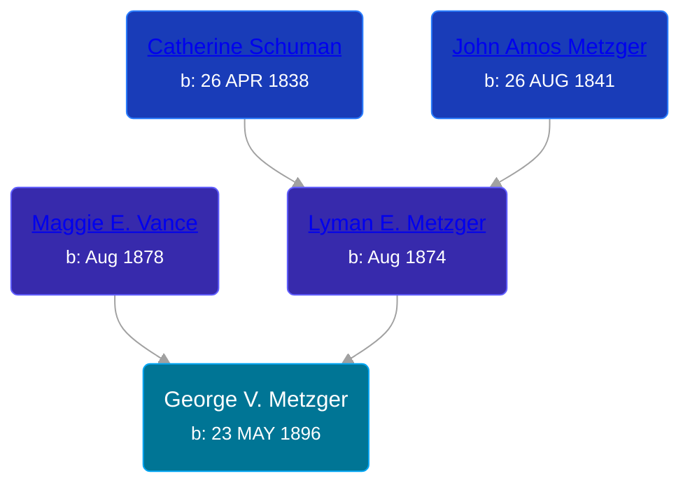

## 🔵 George V. Metzger

Son of [Lyman E. Metzger](/people/7/77568223) and [Maggie E. Vance](/people/9/93797650)





### 📆 Events


Type | Date | Age at Event | Place
------ | ------ | ------ | ------
[Birth](#event-event-2) | 23 MAY 1896 |  | Indiana, USA
[Residence](#event-event-0) | 1900 | 3y, 6m, 7d | Pleasant Township, Wabash, Indiana, USA
[Residence](#event-event-1) | 1920 | 23y, 6m, 7d | Pleasant Township, Wabash, Indiana, USA
[Residence](#event-event-2) | 1930 | 33y, 6m, 7d | Pleasant Township, Wabash, Indiana, USA



- **[Birth](#event-event-2)**
**Date**: 23 MAY 1896, Age:
**Place**: Indiana, USA
- **[Residence](#event-event-0)**
**Date**: 1900, Age: 3y, 6m, 7d
**Place**: Pleasant Township, Wabash, Indiana, USA
- **[Residence](#event-event-1)**
**Date**: 1920, Age: 23y, 6m, 7d
**Place**: Pleasant Township, Wabash, Indiana, USA
- **[Residence](#event-event-2)**
**Date**: 1930, Age: 33y, 6m, 7d
**Place**: Pleasant Township, Wabash, Indiana, USA


## 👩‍❤️‍👨 Relationships

### 🟣 [Ruth ](/people/6/68735088), b. about 1902

#### Children With Ruth
* 🔵 [Living Person](/people/1/11206482)
* 🔵 [Living Person](/people/7/73411825)
### 📰 Event Sources

####  Birth, 23 MAY 1896
* U.S., World War I Draft Registration Cards, 1917-1918  - Roll: 1653170

####  Residence, 1900
* 1900 US Census

####  Residence, 1920
* 1920 US Census

####  Residence, 1930
* 1930 US Census