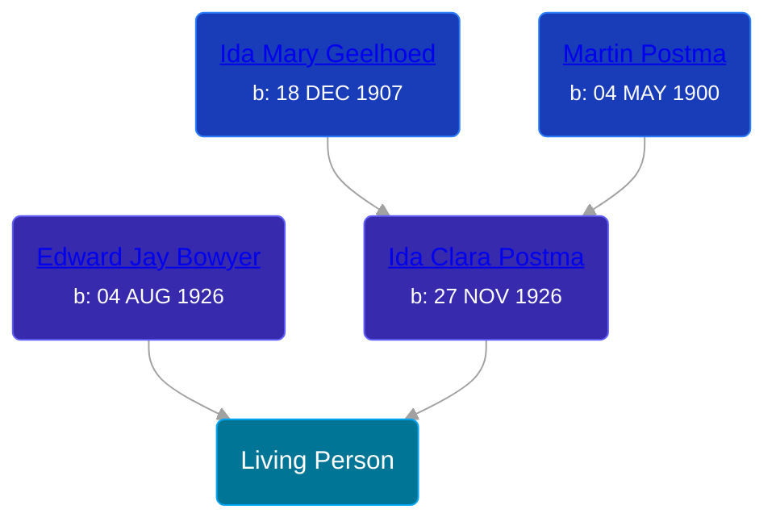

## 🟣 Living Person

Daughter of [Ida Clara Postma](/people/5/59695695) and [Edward Jay Bowyer](/people/8/84507710)





## 👩‍❤️‍👨 Relationships

### 🔵 [Living Person](/people/9/90042352)

### 🔵 [Frederick Harry Hamstra](/people/1/12551600), b. abt 1848
