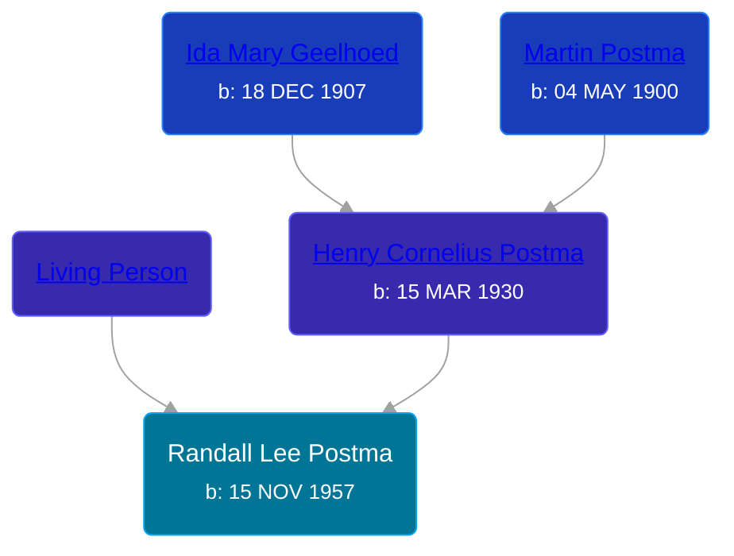

## 🔵 Randall Lee Postma
<small>Age: 58y, 4m, 21d</small>

Son of [Henry Cornelius Postma](/people/2/26394076) and [Living Person](/people/5/57511988)





### 📆 Events


Type | Date | Age at Event | Place
------ | ------ | ------ | ------
Birth | 15 NOV 1957 |  |
[Death](#event-event-3) | 06 APR 2016 | 58y, 4m, 21d |



- **Birth**
**Date**: 15 NOV 1957, Age:
**Place**:
- **[Death](#event-event-3)**
**Date**: 06 APR 2016, Age: 58y, 4m, 21d
**Place**:


## 👩‍❤️‍👨 Relationships

### 🟣 [Living Person](/people/7/76552207)

#### Children With Living Person
* 🟣 [Living Person](/people/7/76880980)
* 🟣 [Living Person](/people/6/67873647)
* 🔵 [Living Person](/people/7/70365421)
### 📰 Event Sources

####  Death, 06 APR 2016
* The Grand Rapids Press
>   
  > Postma, Randall 11/15/1957 - 4/6/2016 Dorr Mr. Randall Lee Postma, age 58, fought the good fight and has entered into his heavenly home on Wednesday, April 6, 2016. Randy was preceded in death by his father, Henry Postma. He will be deeply missed by his wife of 38 years, Cindy (Borowka) Postma; children, Marcy (Nate) Zylstra, Nicole (Mike) Augustine, and Rick (Alison) Postma; grandchildren, Jared, Gavin, Brady, and Mason Randall; mother, Marie Postma; sisters and brother, Roxanne (David) Vanderroer, Starla (Roy) Montoya, Brenda (David) Veele, and Henry (Wanda) Postma; sisters- and brothers-in-law, Cathy (Bob) Kuikstra, Doug Borowka, Brian (Carlena) Borowka, Karen (Joe) Velchansky, Diane Borowka, Don (Tammie) Borowka, Joey (Elsa) Borowka; many aunts, uncles, nieces, nephews, cousins, including special Auntie Kay; and his longtime friends, Bruce Smith, Bill Burrell, Dan Kaminski, and Todd Mingerink; and many good neighbors and friends. Funeral services will be held 11 AM Tuesday, April 12, 2016, at Cornerstone Church, 1675 84th Street SE, Caledonia with pastors Brad Kalajainen and Michael Keller officiating. Relatives and friends may meet Randy's family Sunday from 2-4 PM and Monday from 6-8 PM at the Kubiak-Cook Funeral Home, 4330 18th Dorr and Tuesday from 10-11 AM at the church.
