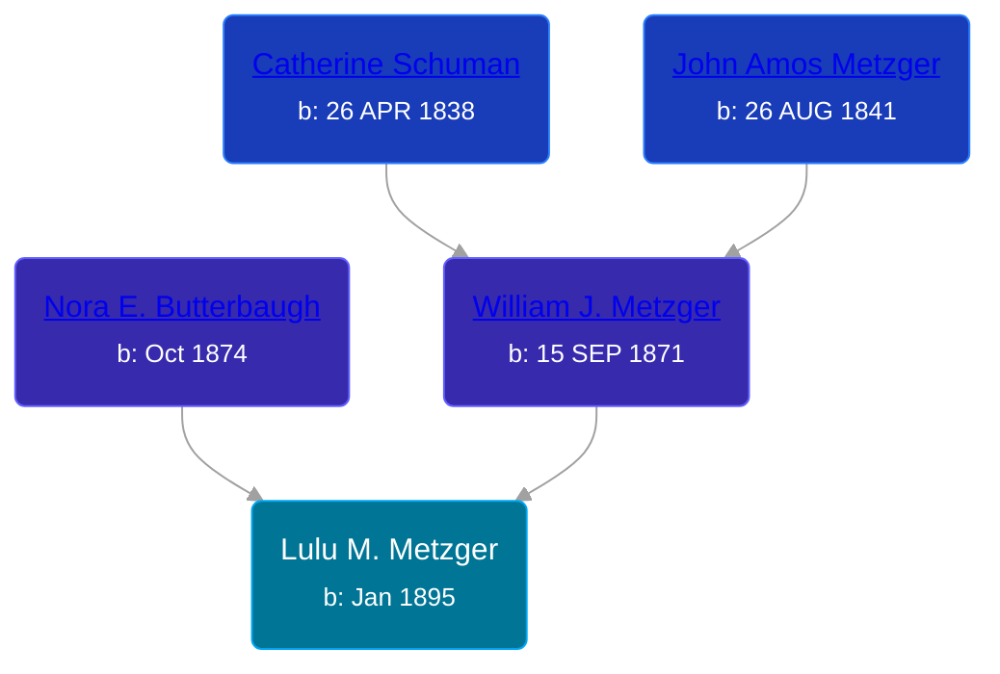

## 🟣 Lulu M. Metzger

Daughter of [William J. Metzger](/people/2/26066694) and [Nora E. Butterbaugh](/people/7/71546258)





### 📆 Events


Type | Date | Age at Event | Place
------ | ------ | ------ | ------
Birth | Jan 1895 |  | Indiana, USA
[Residence](#event-event-0) | 1900 | 4y, 11m | Pleasant Township, Wabash, Indiana, USA
[Residence](#event-event-1) | 1910 | 14y, 11m | Pleasant Township, Wabash, Indiana, USA



- **Birth**
**Date**: Jan 1895, Age:
**Place**: Indiana, USA
- **[Residence](#event-event-0)**
**Date**: 1900, Age: 4y, 11m
**Place**: Pleasant Township, Wabash, Indiana, USA
- **[Residence](#event-event-1)**
**Date**: 1910, Age: 14y, 11m
**Place**: Pleasant Township, Wabash, Indiana, USA


### 📰 Event Sources

####  Residence, 1900
* 1900 US Census

####  Residence, 1910
* 1910 US Census
