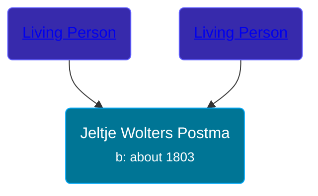

## 🟣 Jeltje Wolters Postma

Daughter of [Living Person](/people/2/26527652) and [Living Person](/people/7/78249927)





### 📆 Events


Type | Date | Age at Event | Place
------ | ------ | ------ | ------
Birth | about 1803 |  |



- **Birth**
**Date**: about 1803, Age:
**Place**:


## 👩‍❤️‍👨 Relationships

### 🔵 [Jakob Sierds van den Berg](/people/7/74645149), b. about 1788

#### Events


Type | Date | Age at Event | Place
------ | ------ | ------ | ------
[Marriage](#event-family-0-event-0) | 07 FEB 1829 | 26y, 2m, 7d | Smallingerland, Netherlands



- **[Marriage](#event-family-0-event-0)**
**Date**: 07 FEB 1829, Age: 26y, 2m, 7d
**Place**: Smallingerland, Netherlands


### 📰 Event Sources

####  Marriage, 07 FEB 1829
* Dutch Civil Register
>   
  > Groom: Jakob Sierds van den Berg  
  > Place of birth: Drachten  
  > Age: 41  
  > Father of the groom: Sierd Jakobs van den Berg  
  > Mother of the groom: Hinke Jogchums  
  > Bride: Jeltje Wolters Postma  
  > Place of birth: Duurswoude, gemeente Opsterland  
  > Age: 26  
  > Father of the bride: Wolter Wolters Postma  
  > Mother of the bride: Trijntje Tjipkes  
  > Event: Huwelijk  
  > Date: Saturday, February 07, 1829  
  > Event place: Smallingerland