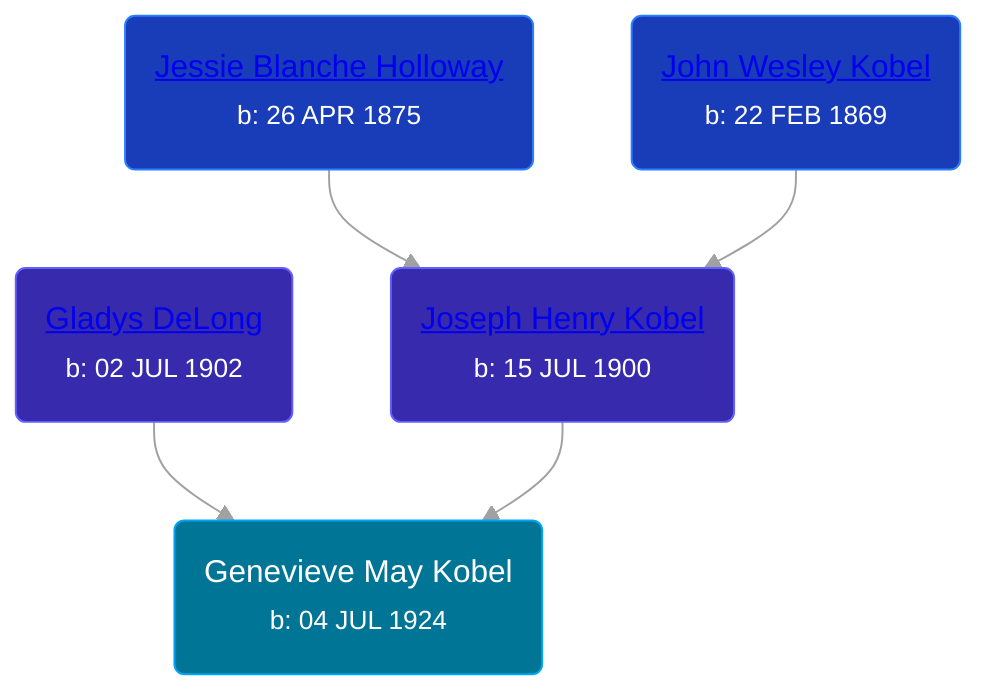

## 🟣 Genevieve May Kobel
<small>Age: 86y, 10m, 28d</small>

Daughter of [Joseph Henry Kobel](/people/5/50400728) and [Gladys DeLong](/people/9/96793928)





### 📆 Events


Type | Date | Age at Event | Place
------ | ------ | ------ | ------
[Birth](#event-event-2) | 04 JUL 1924 |  | Kent, Michigan, USA
[Residence](#event-event-0) | 1930 | 5y, 4m, 26d | Grand Rapids, Kent, Michigan, United States
[Death](#event-event-4) | 02 JUN 2011 | 86y, 10m, 28d | Camarillo, Ventura, California, USA



- **[Birth](#event-event-2)**
**Date**: 04 JUL 1924, Age:
**Place**: Kent, Michigan, USA
- **[Residence](#event-event-0)**
**Date**: 1930, Age: 5y, 4m, 26d
**Place**: Grand Rapids, Kent, Michigan, United States
- **[Death](#event-event-4)**
**Date**: 02 JUN 2011, Age: 86y, 10m, 28d
**Place**: Camarillo, Ventura, California, USA


## 👩‍❤️‍👨 Relationships

### 🔵 [Living Person](/people/9/90556823)

### 📰 Event Sources

####  Birth, 04 JUL 1924
* Ron Wilson's Research

####  Residence, 1930
* 1930 US Census

####  Death, 02 JUN 2011
* Ron Wilson's Research