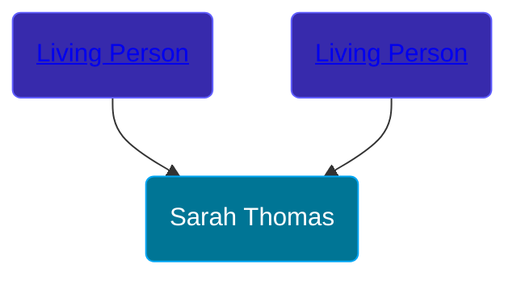

## 🟣 Sarah Thomas
<small>Age: undefined</small>

Daughter of [Living Person](/people/2/28214092) and [Living Person](/people/6/67890576)





### 📆 Events


Type | Date | Age at Event | Place
------ | ------ | ------ | ------
[Death](#event-event-3) | 28 DEC 1711 | undefined |



- **[Death](#event-event-3)**
**Date**: 28 DEC 1711, Age: undefined
**Place**:


## 👩‍❤️‍👨 Relationships

### 🔵 [William Wilmot](/people/4/47205976), b. 1632

#### Events


Type | Date | Age at Event | Place
------ | ------ | ------ | ------
[Marriage](#event-family-0-event-0) | 14 OCT 1658 | undefined |



- **[Marriage](#event-family-0-event-0)**
**Date**: 14 OCT 1658, Age: undefined
**Place**:


#### Children With William Wilmot
* 🔵 [Benjamin Wilmot](/people/3/32094822), b. 07 MAR 1661
* 🟣 [Sarah Wilmot](/people/3/3300032), b. 08 MAR 1663
* 🔵 [William Wilmot](/people/6/66512566), b. 17 OCT 1665
* 🔵 [John Wilmot](/people/2/24658068), b. 20 JAN 1667
* 🟣 [Anna Wilmot](/people/5/59667336), b. 26 FEB 1670
* 🔵 [Alexander Wilmot](/people/3/3478994), b. 18 DEC 1672
* 🟣 [Tabitha Wilmot](/people/7/75933173), b. 12 NOV 1675
* 🟣 [Mary Wilmot](/people/9/97290136), b. 07 JAN 1677
* 🔵 [Thomas Wilmot](/people/3/36930663), b. 21 SEP 1679
* 🟣 [Elizabeth Wilmot](/people/9/91867119), b. 24 MAR 1682
### 📰 Event Sources

####  Marriage, 14 OCT 1658
* The New England Historical and Genealogical Register  - 68
####  Death, 28 DEC 1711
* The New England Historical and Genealogical Register  - 68
