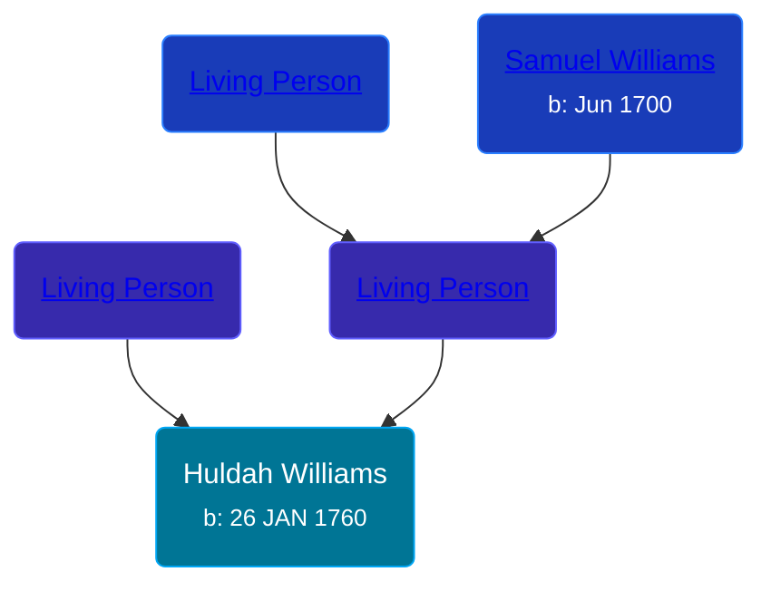

## 🔵 Huldah Williams

Son of [Living Person](/people/5/55971024) and [Living Person](/people/6/62871690)





### 📆 Events


Type | Date | Age at Event | Place
------ | ------ | ------ | ------
[Birth](#event-event-2) | 26 JAN 1760 |  |



- **[Birth](#event-event-2)**
**Date**: 26 JAN 1760, Age:
**Place**:


### 📰 Event Sources

####  Birth, 26 JAN 1760
* The Town and City of Waterbury, Connecticut  - 154