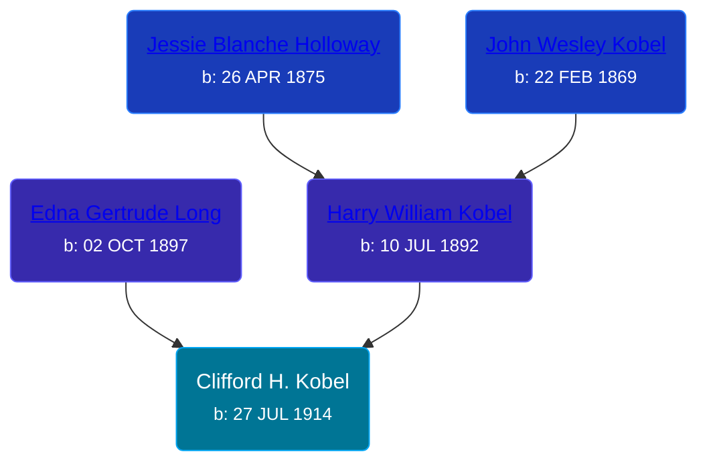

## 🔵 Clifford H. Kobel
<small>Age: 78y, 3m, 21d</small>

Son of [Harry William Kobel](/people/3/30496161) and [Edna Gertrude Long](/people/3/33710863)





### 📆 Events


Type | Date | Age at Event | Place
------ | ------ | ------ | ------
[Birth](#event-event-2) | 27 JUL 1914 |  | Elmira Township, Antrim, Michigan, USA
[Residence](#event-event-0) | 08 JAN 1920 | 5y, 5m, 11d | Warner Township, Antrim, Michigan, USA
[Residence](#event-event-1) | 05 APR 1930 | 15y, 8m, 8d | Chestonia Township, Antrim, Michigan, USA
[Death](#event-event-5) | 18 NOV 1992 | 78y, 3m, 21d | Traverse City, Grand Traverse, Michigan, USA



- **[Birth](#event-event-2)**
**Date**: 27 JUL 1914, Age:
**Place**: Elmira Township, Antrim, Michigan, USA
- **[Residence](#event-event-0)**
**Date**: 08 JAN 1920, Age: 5y, 5m, 11d
**Place**: Warner Township, Antrim, Michigan, USA
- **[Residence](#event-event-1)**
**Date**: 05 APR 1930, Age: 15y, 8m, 8d
**Place**: Chestonia Township, Antrim, Michigan, USA
- **[Death](#event-event-5)**
**Date**: 18 NOV 1992, Age: 78y, 3m, 21d
**Place**: Traverse City, Grand Traverse, Michigan, USA


## 👩‍❤️‍👨 Relationships

### 🟣 [Gladys Marie Hollenbeck](/people/5/52265274), b. 05 AUG 1917

#### Events


Type | Date | Age at Event | Place
------ | ------ | ------ | ------
[Marriage](#event-family-0-event-0) | 07 DEC 1935 | 21y, 4m, 10d | Standish, Arenac, Michigan, USA



- **[Marriage](#event-family-0-event-0)**
**Date**: 07 DEC 1935, Age: 21y, 4m, 10d
**Place**: Standish, Arenac, Michigan, USA


#### Children With Gladys Marie Hollenbeck
* 🔵 [Living Person](/people/7/79176855)
* 🔵 [Kenneth Kobel](/people/4/44916336), b. 1941
* 🟣 [Living Person](/people/4/4464405)
### 📰 Event Sources

####  Birth, 27 JUL 1914
* Ron Wilson's Research

####  Residence, 08 JAN 1920
* 1920 US Census
>   
  > Name: Clifford Kobel  
  > Age: 5  
  > Birth Year: abt 1915  
  > Birthplace: Michigan  
  > Home in 1920: Wamer, Antrim, Michigan  
  > Residence Date: 1920  
  > Race: White  
  > Gender: Male  
  > Relation to Head of House: Son  
  > Marital Status: Single  
  > Father's Name: Harry Kobel  
  > Father's Birthplace: Michigan  
  > Mother's Name: Edna Kobel  
  > Mother's Birthplace: Michigan  
  > Able to Speak English: Yes  
  > Attended School: No

####  Residence, 05 APR 1930
* 1930 US Census

####  Marriage, 07 DEC 1935
* Ron Wilson's Research
####  Death, 18 NOV 1992
* Ron Wilson's Research
