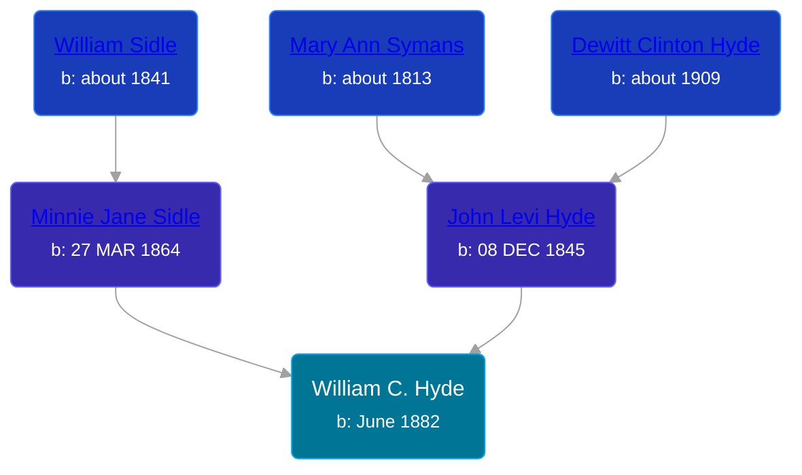

## 🔵 William C. Hyde

Son of [John Levi Hyde](/people/2/23020300) and [Minnie Jane Sidle](/people/7/73883806)





### 📆 Events


Type | Date | Age at Event | Place
------ | ------ | ------ | ------
Birth | June 1882 |  | Michigan, USA
[Residence](#event-event-0) | 1884 | 1y, 6m | Grant, Newaygo, Michigan, USA
[Residence](#event-event-1) | 1900 | 17y, 6m | Grant, Newaygo, Michigan, USA



- **Birth**
**Date**: June 1882, Age:
**Place**: Michigan, USA
- **[Residence](#event-event-0)**
**Date**: 1884, Age: 1y, 6m
**Place**: Grant, Newaygo, Michigan, USA
- **[Residence](#event-event-1)**
**Date**: 1900, Age: 17y, 6m
**Place**: Grant, Newaygo, Michigan, USA


## 👩‍❤️‍👨 Relationships

### 🟣 [Living Person](/people/3/32326528)

### 📰 Event Sources

####  Residence, 1884
* 1884 Michigan State Census

####  Residence, 1900
* 1900 US Census
