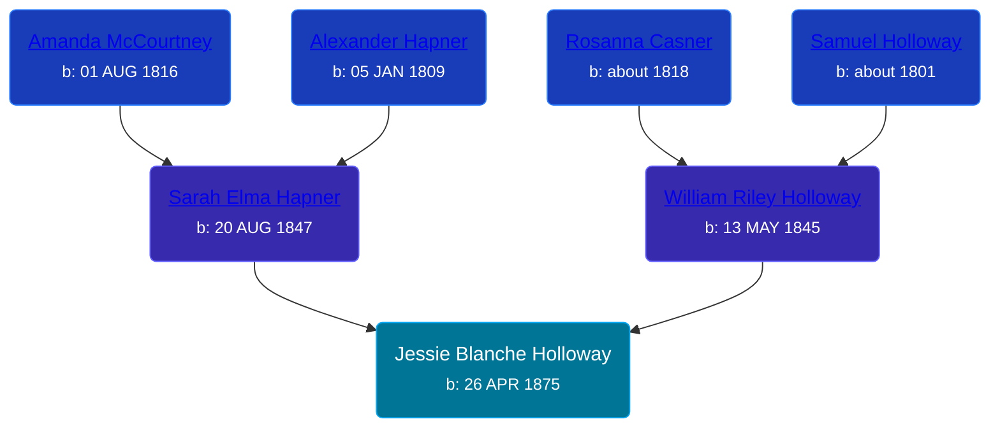

## 🟣 Jessie Blanche Holloway
<small>Age: 74y, 3m</small>

Daughter of [William Riley Holloway](/people/9/90949012) and [Sarah Elma Hapner](/people/2/20173654)





### 📆 Events


Type | Date | Age at Event | Place
------ | ------ | ------ | ------
[Birth](#event-event-3) | 26 APR 1875 |  | Chippewa Township, Isabella, Michigan, USA
[Residence](#event-event-0) | Jun 1880 | 5y, 1m, 4d | Chippewa Township, Isabella, Michigan, USA
[Residence](#event-event-1) | 01 JUN 1900 | 25y, 1m, 5d | Warner Township, Antrim, Michigan, USA
[Residence](#event-event-2) | 15 APR 1910 | 34y, 11m, 19d | Warner Township, Antrim, Michigan, USA
[Residence](#event-event-3) | 05 JAN 1920 | 44y, 8m, 9d | Warner Township, Antrim, Michigan, USA
[Residence](#event-event-4) | 29 APR 1930 | 55y, 3d | Warner Township, Antrim, Michigan, USA
[Death](#event-event-9) | 26 JUL 1949 | 74y, 3m | Lansing, Ingham, Michigan, USA
[Burial](#event-event-10) |  |  | Grandville Cemetery, Grandville, Ottawa, Michigan, USA



- **[Birth](#event-event-3)**
**Date**: 26 APR 1875, Age:
**Place**: Chippewa Township, Isabella, Michigan, USA
- **[Residence](#event-event-0)**
**Date**: Jun 1880, Age: 5y, 1m, 4d
**Place**: Chippewa Township, Isabella, Michigan, USA
- **[Residence](#event-event-1)**
**Date**: 01 JUN 1900, Age: 25y, 1m, 5d
**Place**: Warner Township, Antrim, Michigan, USA
- **[Residence](#event-event-2)**
**Date**: 15 APR 1910, Age: 34y, 11m, 19d
**Place**: Warner Township, Antrim, Michigan, USA
- **[Residence](#event-event-3)**
**Date**: 05 JAN 1920, Age: 44y, 8m, 9d
**Place**: Warner Township, Antrim, Michigan, USA
- **[Residence](#event-event-4)**
**Date**: 29 APR 1930, Age: 55y, 3d
**Place**: Warner Township, Antrim, Michigan, USA
- **[Death](#event-event-9)**
**Date**: 26 JUL 1949, Age: 74y, 3m
**Place**: Lansing, Ingham, Michigan, USA
- **[Burial](#event-event-10)**
**Date**:
**Place**: Grandville Cemetery, Grandville, Ottawa, Michigan, USA


## 👩‍❤️‍👨 Relationships

### 🔵 [John Wesley Kobel](/people/2/24649136), b. 22 FEB 1869

#### Events


Type | Date | Age at Event | Place
------ | ------ | ------ | ------
[Marriage](#event-family-0-event-0) | 14 MAR 1892 | 16y, 10m, 18d | Mount Pleasant, Isabella, Michigan, USA



- **[Marriage](#event-family-0-event-0)**
**Date**: 14 MAR 1892, Age: 16y, 10m, 18d
**Place**: Mount Pleasant, Isabella, Michigan, USA


#### Children With John Wesley Kobel
* 🔵 [Harry William Kobel](/people/3/30496161), b. 10 JUL 1892
* 🔵 [Fred Hayes Kobel](/people/1/1672312), b. 29 JUL 1894
* 🟣 [Bessie Elma Kobel](/people/3/34277096), b. 14 SEP 1896
* 🟣 [Vedah May Kobel](/people/5/52554620), b. 25 SEP 1898
* 🔵 [Joseph Henry Kobel](/people/5/50400728), b. 15 JUL 1900
* 🔵 [Kobel](/people/4/43995845), b. 16 NOV 1902
* 🟣 [Sarah Blanche Kobel](/people/4/40397804), b. 13 JAN 1904
* 🟣 [Mabel Nellie Kobel](/people/6/69123608), b. 28 OCT 1906
* 🟣 [Kobel](/people/7/71908748), b. 29 JAN 1909
* 🟣 [Elvira Jannette Kobel](/people/2/2756961), b. 26 FEB 1910
* 🟣 [Jessie Gertrude Kobel](/people/9/95617946), b. 27 SEP 1918
### 📰 Event Sources

####  Birth, 26 APR 1875
* Michigan, Births and Christenings Index, 1867-1911
>   
  > Name: Jesse B Holloway  
  > Gender: Male (?)  
  > Birth Place: Chippewa, Isabella Co, Michigan  
  > Birth Date: 26 Apr 1875  
  > Baptism Place: Isabella, Michigan  
  > Father's Name: W R Holloway  
  > Mother's Name: Sarah  
  > FHL Film Number: 1005117

####  Residence, Jun 1880
* 1880 US Census

####  Residence, 01 JUN 1900
* 1900 US Census

####  Residence, 15 APR 1910
* 1910 US Census

####  Residence, 05 JAN 1920
* 1920 US Census

####  Residence, 29 APR 1930
* 1930 US Census

####  Death, 26 JUL 1949
* Michigan, Death Records, 1867-1950
>   
  > Name:Jessie Kobel  
  > [Jessie Holloway]   
  > Gender:Female  
  > Marital Status:Widowed  
  > Birth Date:Apr, 1874  
  > Birth Place:Michigan  
  > Death Date:26 Jul 1949  
  > Death Place:Lansing, Ingham, Michigan, USA  
  > Death Age:75  
  > File Number: 024353  
  > Father: William R Holloway  
  > Mother: Sarah Hapner
* The Grand Rapids Press  - 27 Jul 1949
>   
  > KOBEL -- Mrs. Jessie B. Kobel, aged 75, widow of the late John Kobel, passed away Tuesday morning at the McLachlin Osteopathic hospital, Lansing, Mich. Surviving are two sons, Harry of Gladwin, Joseph of Grand Rapids, and five daughters, Bessie Metzger, Mrs. Allen Lowing, Mrs. John Workman all of Grand Rapids, Mrs. Ramon Kolk of Zeeland, Mrs. ClareGould of Holt, Mich; two brothers and four sisters; twenty-seven grandchildren and twenty-five great-grandchildren. Funeral services will beheld Friday at 2 p.m. at the Vanderpool Funeral home. Arrangements byLogan Funeral Home, Holt, Mich., Rev. Jesse Goodheart officiating. Interment Wyoming Township Cemetery.

####  Burial
* Grandville Cemetery Burials To Date
####  Marriage, 14 MAR 1892
* Michigan, Marriage Records, 1867-1952
>   
  > Name:Jessie B Holloway  
  > Gender:Female  
  > Race:White  
  > Birth Year:abt 1876  
  > Birth Place:Michigan  
  > Marriage Date:14 Mar 1892  
  > Marriage Place:MT Pleasant, Isabella, Michigan, USA  
  > Age:16  
  > Residence Place:Deerfield Township  
  > Father:William R Holloway  
  > Mother:Sadie Hapner  
  > Spouse:John W Kobel  
  > Spouse Gender:Male  
  > Spouse Race:White  
  > Spouse Age:23  
  > Spouse Birth Place:Isabella County  
  > Spouse Residence Place:Antrim Co  
  > Spouse Father:Joseph Kobel  
  > Spouse Mother:Anginett Brown  
  > Record Number:211  
  > Film:46  
  > Film Description:1892 Clinton - 1892 Manistee
