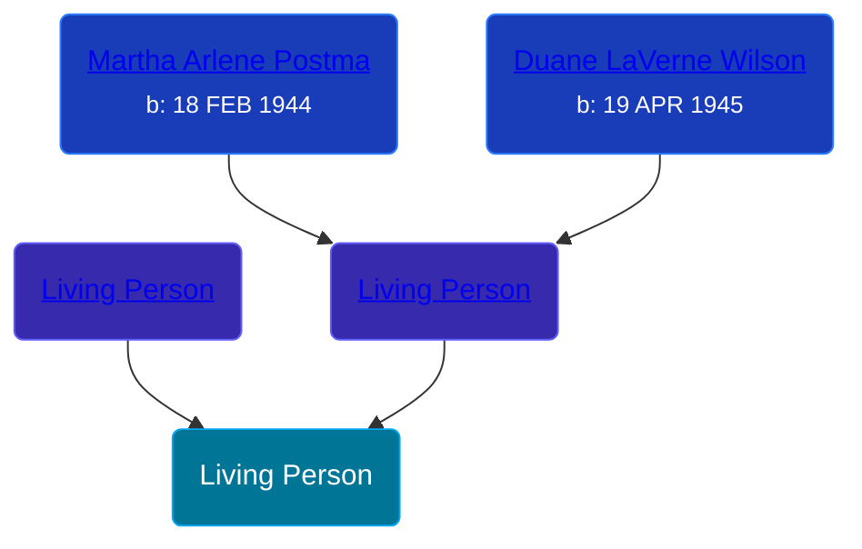

## 🟣 Living Person

Daughter of [Living Person](/people/4/46067436) and [Living Person](/people/6/68623568)





## 👩‍❤️‍👨 Relationships

### 🔵 [Living Person](/people/9/93135357)

#### Children With Living Person
* 🔵 [Living Person](/people/2/23477432)
* 🟣 [Living Person](/people/7/76243458)