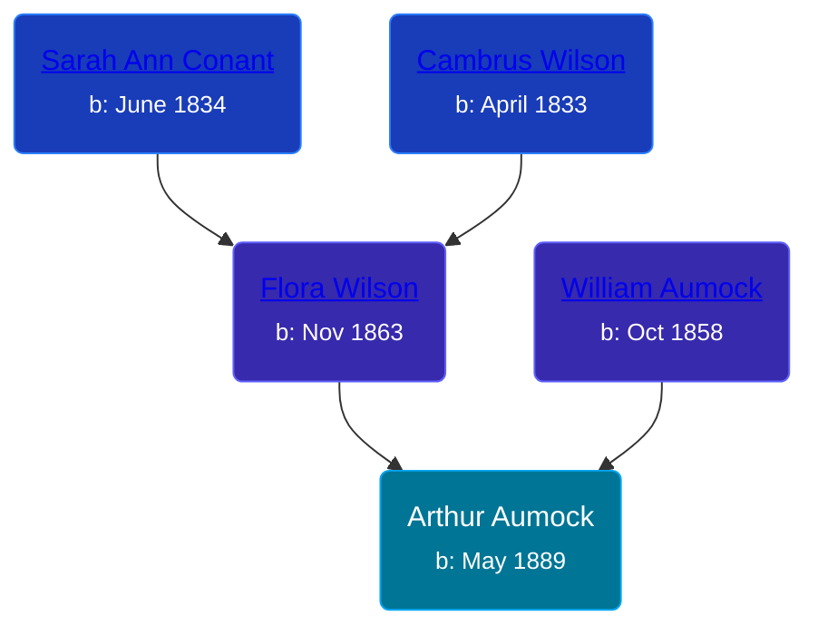

## 🔵 Arthur Aumock

Son of [William Aumock](/people/5/50418111) and [Flora Wilson](/people/2/2426620)





### 📆 Events


Type | Date | Age at Event | Place
------ | ------ | ------ | ------
Birth | May 1889 |  | New York, USA
[Residence](#event-event-0) | 16 FEB 1892 | 2y, 9m, 16d | Savannah, Wayne, New York, USA
[Residence](#event-event-1) | 06 JUN 1900 | 11y, 1m, 6d | Savannah, Wayne, New York, USA



- **Birth**
**Date**: May 1889, Age:
**Place**: New York, USA
- **[Residence](#event-event-0)**
**Date**: 16 FEB 1892, Age: 2y, 9m, 16d
**Place**: Savannah, Wayne, New York, USA
- **[Residence](#event-event-1)**
**Date**: 06 JUN 1900, Age: 11y, 1m, 6d
**Place**: Savannah, Wayne, New York, USA


### 📰 Event Sources

####  Residence, 16 FEB 1892
* 1892 New York Census

####  Residence, 06 JUN 1900
* 1900 US Census
