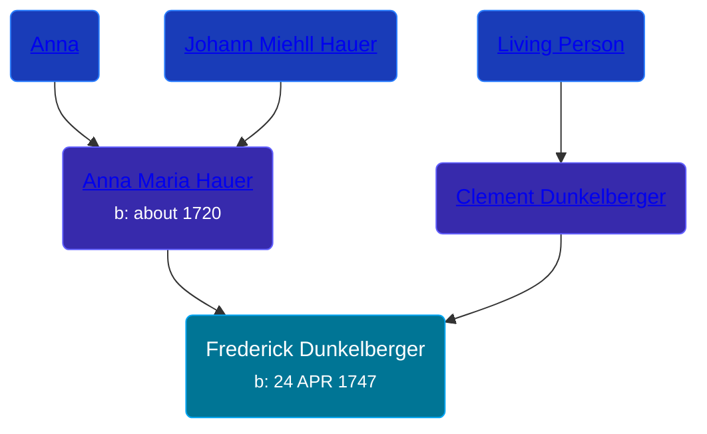

## 🔵 Frederick Dunkelberger
<small>Age: 67y, 9m</small>

Son of [Clement Dunkelberger](/people/1/13545057) and [Anna Maria Hauer](/people/2/22963774)





### 📆 Events


Type | Date | Age at Event | Place
------ | ------ | ------ | ------
[Birth](#event-event-2) | 24 APR 1747 |  | Windsor Township, Berks, Pennsylvania, USA
[Death](#event-event-3) | 24 JAN 1815 | 67y, 9m | Northumberland, Pennsylvania, USA



- **[Birth](#event-event-2)**
**Date**: 24 APR 1747, Age:
**Place**: Windsor Township, Berks, Pennsylvania, USA
- **[Death](#event-event-3)**
**Date**: 24 JAN 1815, Age: 67y, 9m
**Place**: Northumberland, Pennsylvania, USA


## 👩‍❤️‍👨 Relationships

### 🟣 [Catharina Hauer](/people/7/70737648), b. about 18 OCT 1749

#### Children With Catharina Hauer
* 🟣 [Magdalena Dunkelberger](/people/9/94381550), b. about 1785
### 📰 Event Sources

####  Birth, 24 APR 1747
* Roy Fletcher Stohler's Research

####  Death, 24 JAN 1815
* Roy Fletcher Stohler's Research