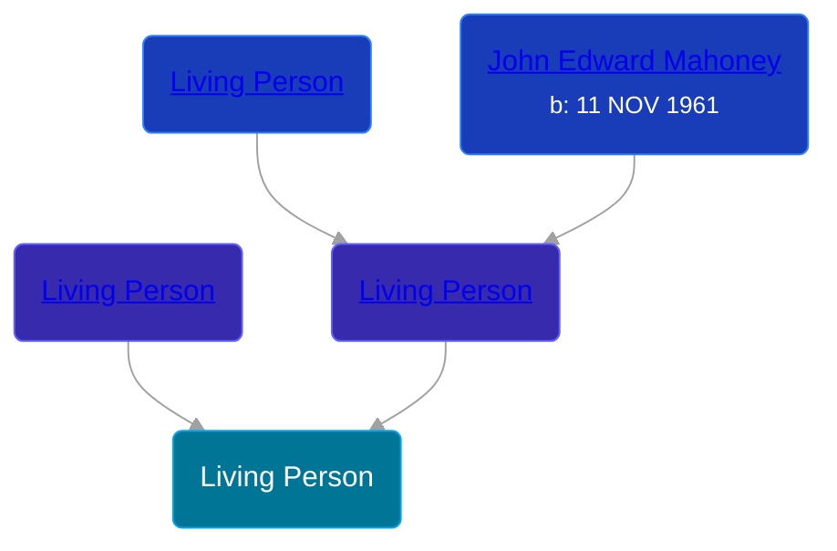

## 🟣 Living Person

Daughter of [Living Person](/people/7/79073611) and [Living Person](/people/9/91797184)



```mermaid
graph
classDef grands fill:#193cb8,stroke:#2b7fff,stroke-width:1px,color:#fff;
classDef parents fill:#372aac,stroke:#615fff,stroke-width:1px,color:#fff;
classDef primary fill:#007595,stroke:#00a6f4,stroke-width:1px,color:#fff;
29332362(Living Person):::primary
91797184(<a class="text-white" href="/people/9/91797184">Living Person</a>):::parents-->29332362
79073611(<a class="text-white" href="/people/7/79073611">Living Person</a>):::parents-->29332362
27906701(<a class="text-white" href="/people/2/27906701">Living Person</a>):::grands-->79073611
20318131(<a class="text-white" href="/people/2/20318131">John Edward Mahoney</a><br /><small>b: 11 NOV 1961</small>):::grands-->79073611
linkStyle default stroke:#a1a1a1
```

