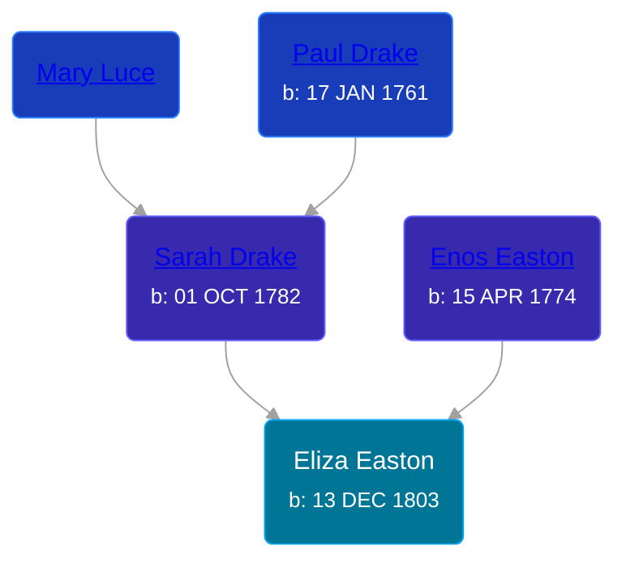

## 🟣 Eliza Easton
<small>Age: 65y, 3m, 19d</small>

Daughter of [Enos Easton](/people/9/95960336) and [Sarah Drake](/people/5/55814233)





### 📆 Events


Type | Date | Age at Event | Place
------ | ------ | ------ | ------
Birth | 13 DEC 1803 |  | New York, USA
[Residence](#event-event-0) | 19 JUN 1855 | 51y, 6m, 6d | Middlesex, Yates, New York, USA
[Residence](#event-event-1) | 01 JUN 1865 | 61y, 5m, 18d | Middlesex, Yates, New York, USA
Death | 02 APR 1869 | 65y, 3m, 19d | Yates, New York, USA



- **Birth**
**Date**: 13 DEC 1803, Age:
**Place**: New York, USA
- **[Residence](#event-event-0)**
**Date**: 19 JUN 1855, Age: 51y, 6m, 6d
**Place**: Middlesex, Yates, New York, USA
- **[Residence](#event-event-1)**
**Date**: 01 JUN 1865, Age: 61y, 5m, 18d
**Place**: Middlesex, Yates, New York, USA
- **Death**
**Date**: 02 APR 1869, Age: 65y, 3m, 19d
**Place**: Yates, New York, USA


## 👩‍❤️‍👨 Relationships

### 🔵 [William J. Brown](/people/3/37180394), b. about 1798

#### Children With William J. Brown
* 🔵 [Charles Lewis Brown](/people/7/70538697), b. 06 MAR 1820
### 📰 Event Sources

####  Residence, 19 JUN 1855
* 1855 New York State Census

####  Residence, 01 JUN 1865
* 1865 New York Census
