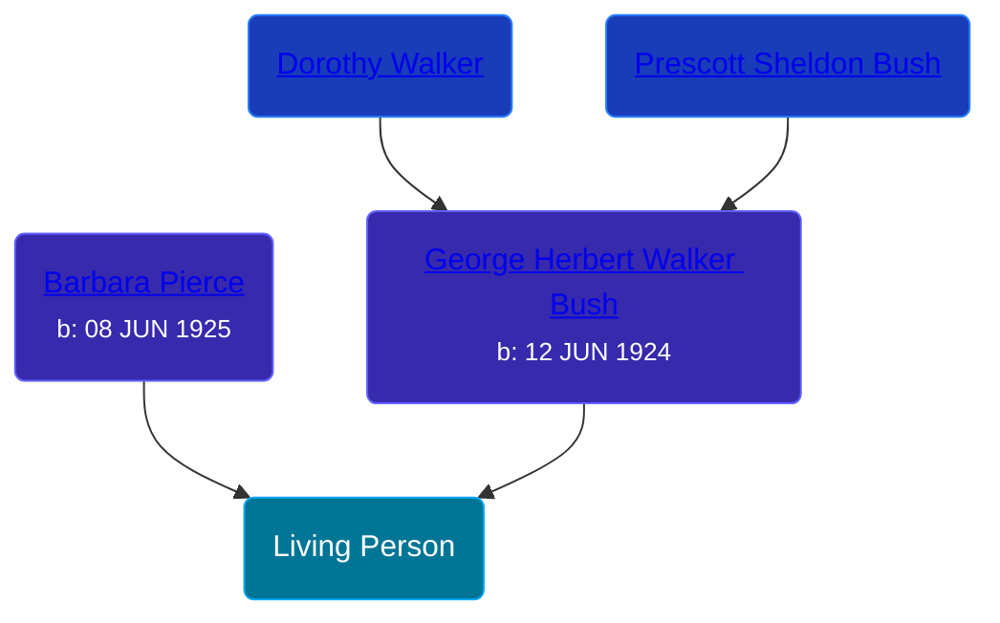

## 🔵 George Walker Bush

Son of [George Herbert Walker Bush](/people/8/89339690) and [Barbara Pierce](/people/5/53323331)





> [!note]
> This is a public figure and therefore bypasses some privacy restrictions for living persons.

## 👩‍❤️‍👨 Relationships

### 🟣 [Living Person](/people/7/74109505)

#### Children With Living Person
* 🟣 [Living Person](/people/4/44267257)
* 🟣 [Jenna Welch Bush](/people/8/82743343), b. 25 NOV 1981
## 📝 Notes
>   
  > George Walker Bush was the 43rd president of the United States, serving two terms from 2001 to 2009.