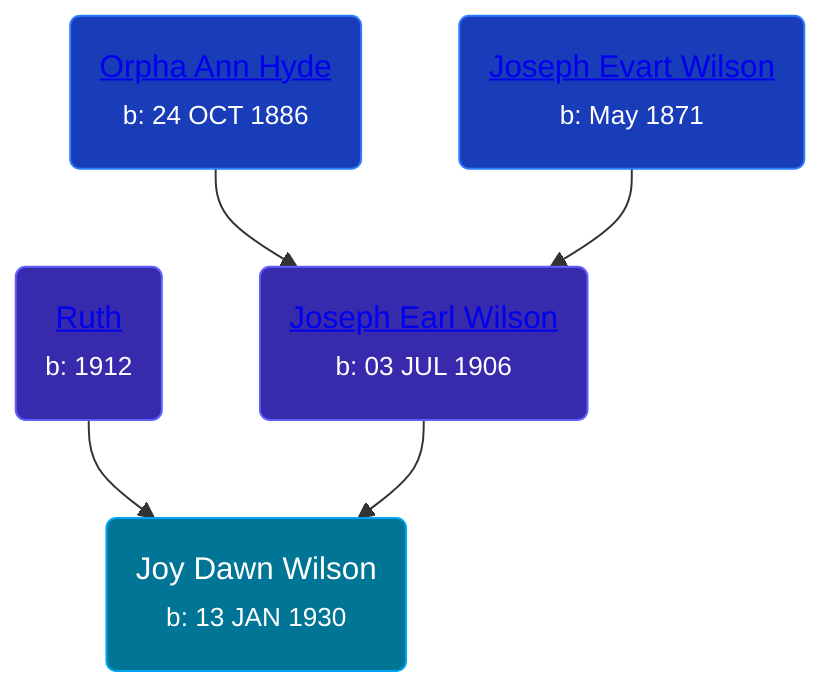

## 🟣 Joy Dawn Wilson
<small>Age: 60y, 10m, 15d</small>

Daughter of [Joseph Earl Wilson](/people/3/35616804) and [Ruth ](/people/7/72945090)





### 📆 Events


Type | Date | Age at Event | Place
------ | ------ | ------ | ------
Birth | 13 JAN 1930 |  | Michigan, USA
[Residence](#event-event-0) | 1930 | -1y, 10m, 17d | Grand Rapids, Kent, Michigan, United States
[Death](#event-event-4) | 28 NOV 1990 | 60y, 10m, 15d | Caledonia, Kent, Michigan, USA



- **Birth**
**Date**: 13 JAN 1930, Age:
**Place**: Michigan, USA
- **[Residence](#event-event-0)**
**Date**: 1930, Age: -1y, 10m, 17d
**Place**: Grand Rapids, Kent, Michigan, United States
- **[Death](#event-event-4)**
**Date**: 28 NOV 1990, Age: 60y, 10m, 15d
**Place**: Caledonia, Kent, Michigan, USA


## 👩‍❤️‍👨 Relationships

### 🔵 [Living Person](/people/1/16093179)

#### Children With Living Person
* 🔵 [Living Person](/people/2/29348168)
* 🔵 [Living Person](/people/3/36204506)
### 📰 Event Sources

####  Residence, 1930
* 1930 US Census

####  Death, 28 NOV 1990
* Kent County, Michigan Death Certificates  - 203920
* Michigan Deaths, 1971-1996
>   
  > Name: Joy D Orosz  
  > Birth Date: 13 Jan 1930  
  > Death Date: 28 Nov 1990  
  > Gender: Female  
  > Residence: Thornapple, Barry, Michigan  
  > Place of Death: Caledonia, Kent, Michigan
* The Grand Rapids Press
>   
  > OROSZ -- Mrs. Joy Dawn Orosz, aged 60, passed away of accidental injuries, Wednesday, November 28, 1990. She is survived by her beloved husband, Joseph of Caledonia; her children, Stephen and Linda Orosz of Grand Rapids, Timothy Orosz of Door; her grandchildren, Natalie, Nicolett, Stacy and Joseph; her mother, Mrs. Ruth Wilson of Grand Rapids; her father-in-law and mother-in-law, Joseph and Adeline Orosz of Grand Rapids; her sister and brother-in-law, June and Jack Bowman; her brother and sister-in-law, Gary and Sherry Wilson, all of Grand Rapids; many nieces and nephews; and her very special friend, Kathy Byze of Kentwood. Funeral Services for Joy will be held Saturday at 11 a.m. at the Caledonia Funeral Chapel, 616 East Main, with the Rev. Doug VanDoren officiating. Interment Chapel Hill Memorial Gardens. Relatives and friends may meet the family at the funeral home Friday 2 to 4 and 7 to 9 p.m.
