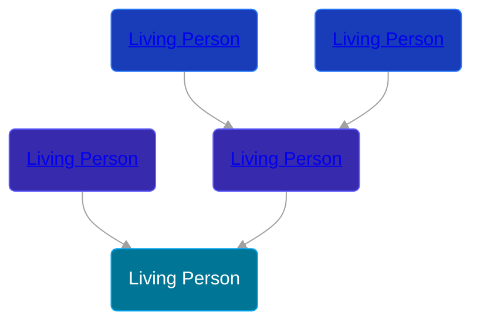

## 🔵 Living Person

Son of [Living Person](/people/5/59787254) and [Living Person](/people/1/11240493)



```mermaid
graph
classDef grands fill:#193cb8,stroke:#2b7fff,stroke-width:1px,color:#fff;
classDef parents fill:#372aac,stroke:#615fff,stroke-width:1px,color:#fff;
classDef primary fill:#007595,stroke:#00a6f4,stroke-width:1px,color:#fff;
29576880(Living Person):::primary
11240493(<a class="text-white" href="/people/1/11240493">Living Person</a>):::parents-->29576880
59787254(<a class="text-white" href="/people/5/59787254">Living Person</a>):::parents-->29576880
47560746(<a class="text-white" href="/people/4/47560746">Living Person</a>):::grands-->59787254
89027494(<a class="text-white" href="/people/8/89027494">Living Person</a>):::grands-->59787254
linkStyle default stroke:#a1a1a1
```

