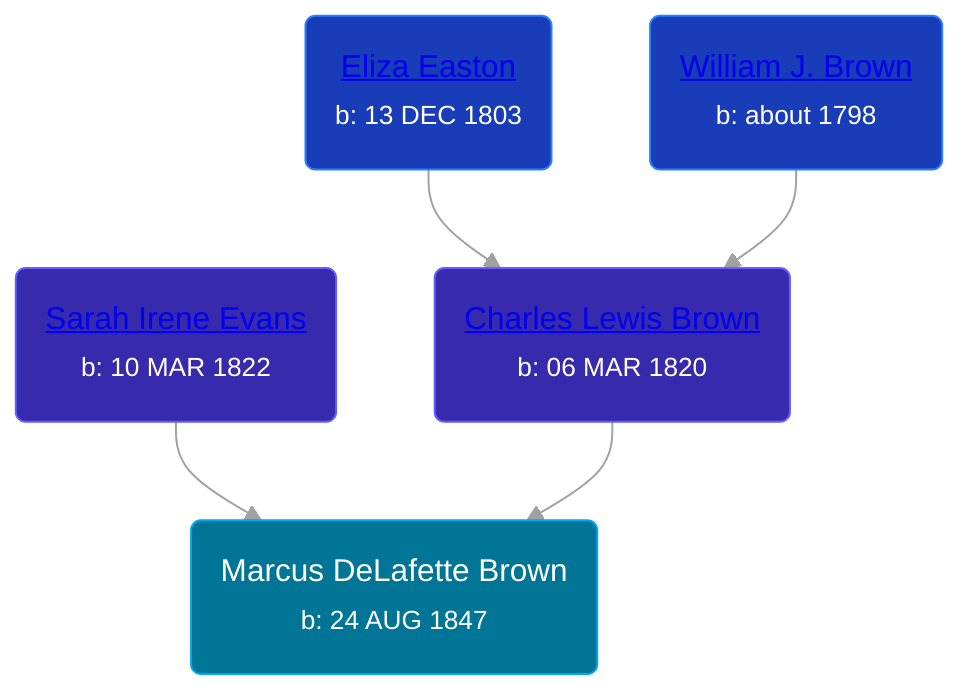

## 🔵 Marcus DeLafette Brown
<small>Age: 52y, 8m, 9d</small>

Son of [Charles Lewis Brown](/people/7/70538697) and [Sarah Irene Evans](/people/4/47294572)





### 📆 Events


Type | Date | Age at Event | Place
------ | ------ | ------ | ------
Birth | 24 AUG 1847 |  | Ionia, Michigan, USA
Death | 03 MAY 1900 | 52y, 8m, 9d | Harrison, Clare County, Michigan, USA



- **Birth**
**Date**: 24 AUG 1847, Age:
**Place**: Ionia, Michigan, USA
- **Death**
**Date**: 03 MAY 1900, Age: 52y, 8m, 9d
**Place**: Harrison, Clare County, Michigan, USA

