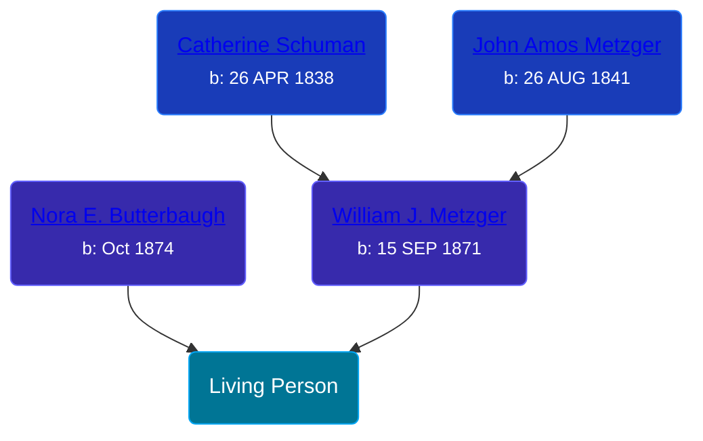

## 🟣 Living Person

Daughter of [William J. Metzger](/people/2/26066694) and [Nora E. Butterbaugh](/people/7/71546258)



```mermaid
graph
classDef grands fill:#193cb8,stroke:#2b7fff,stroke-width:1px,color:#fff;
classDef parents fill:#372aac,stroke:#615fff,stroke-width:1px,color:#fff;
classDef primary fill:#007595,stroke:#00a6f4,stroke-width:1px,color:#fff;
299104(Living Person):::primary
71546258(<a class="text-white" href="/people/7/71546258">Nora E. Butterbaugh</a><br /><small>b: Oct 1874</small>):::parents-->299104
26066694(<a class="text-white" href="/people/2/26066694">William J. Metzger</a><br /><small>b: 15 SEP 1871</small>):::parents-->299104
39599940(<a class="text-white" href="/people/3/39599940">Catherine Schuman</a><br /><small>b: 26 APR 1838</small>):::grands-->26066694
28893894(<a class="text-white" href="/people/2/28893894">John Amos Metzger</a><br /><small>b: 26 AUG 1841</small>):::grands-->26066694
```

