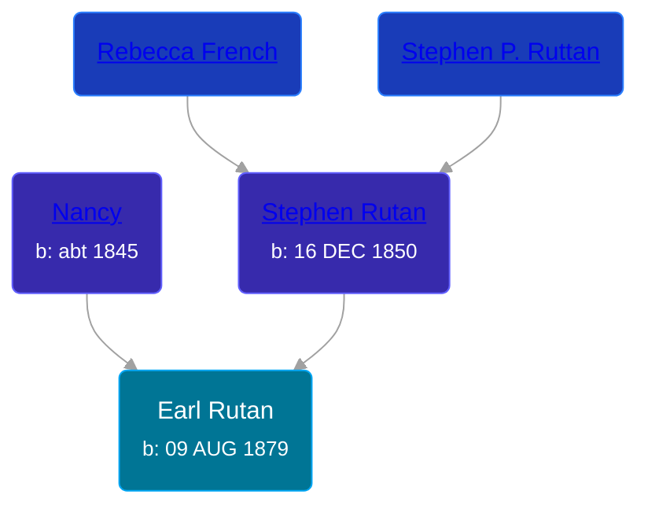

## 🔵 Earl Rutan
<small>Age: 52y, 3m, 21d</small>

Son of [Stephen Rutan](/people/3/38101242) and [Nancy ](/people/2/21074596)





### 📆 Events


Type | Date | Age at Event | Place
------ | ------ | ------ | ------
Birth | 09 AUG 1879 |  | Ohio, USA
[Residence](#event-event-1) | 04 JUN 1880 | 9m, 26d | Somerset Township, Hillsdale, Michigan, USA
[Residence](#event-event-2) | 09 JUN 1900 | 20y, 10m | Somerset Township, Hillsdale, Michigan, USA
Death | 1932 | 52y, 3m, 21d |



- **Birth**
**Date**: 09 AUG 1879, Age:
**Place**: Ohio, USA
- **[Residence](#event-event-1)**
**Date**: 04 JUN 1880, Age: 9m, 26d
**Place**: Somerset Township, Hillsdale, Michigan, USA
- **[Residence](#event-event-2)**
**Date**: 09 JUN 1900, Age: 20y, 10m
**Place**: Somerset Township, Hillsdale, Michigan, USA
- **Death**
**Date**: 1932, Age: 52y, 3m, 21d
**Place**:


## 👩‍❤️‍👨 Relationships

### 🟣 [Florence Wheeler](/people/4/48964520), b. Dec 1882

#### Events


Type | Date | Age at Event | Place
------ | ------ | ------ | ------
[Marriage](#event-family-0-event-0) | 08 OCT 1899 | 20y, 1m, 29d | Somerset, Hillsdale, Michigan, USA



- **[Marriage](#event-family-0-event-0)**
**Date**: 08 OCT 1899, Age: 20y, 1m, 29d
**Place**: Somerset, Hillsdale, Michigan, USA


#### Children With Florence Wheeler
* 🔵 [Glenn W. Rutan](/people/8/82524536), b. Mar 1900
* 🔵 [Milton Wheeler Rutan](/people/2/20825556), b. 07 NOV 1901
### 📰 Event Sources

####  Residence, 04 JUN 1880
* 1880 US Census
>
  > Name: Earl Rutan
  > Age: 9/12
  > Birth Date: Aug abt 1879
  > Birthplace: Michigan
  > Home in 1880: Somerset, Hillsdale, Michigan, USA
  > Dwelling Number: 50
  > Race: White
  > Gender: Male
  > Relation to Head of House: Son
  > Marital Status: Single
  > Father's Name: Stephen Rutan
  > Father's Birthplace: Pennsylvania
  > Mother's Name: Nancy Rutan
  > Mother's Birthplace: Michigan
  >
  > Household Members
  > Stephen Rutan, 29
  > Nancy Rutan, 35
  > David M. Rutan, 5
  > Stephen Rutan, 2
  > Earl Rutan, 9/12
  >

####  Marriage, 08 OCT 1899
* Michigan, Marriage Records, 1867-1952
>
  > Name: Flossie Wheeler
  > Gender: Female
  > Race: White
  > Age: 17
  > Birth Date: 1882
  > Birth Place: Ohio
  > Marriage Date: 8 Oct 1899
  > Marriage Place: Somerset, Hillsdale, Michigan, USA
  > Residence Place: Somerset Center
  > Father: Willer Wheeler
  > Mother: W W Dixon
  > Spouse: Earl Rutan
  > Spouse Gender: Male
  > Spouse Race: White
  > Spouse Age: 20
  > Spouse Birth Date: abt 1879
  > Spouse Birth Place: Ohio
  > Spouse Residence Place: Somerset Center
  > Spouse Father: S Rutan
  > Spouse Mother: Nancy McLain
  > Record Number: 3488

####  Residence, 09 JUN 1900
* 1900 US Census
>
  > Name: Earl Rutan
  > Age: 20
  > Birth Date: Aug 1879
  > Birthplace: Michigan, USA
  > Home in 1900: Somerset, Hillsdale, Michigan
  > Sheet Number: 5
  > Number of Dwelling in Order of Visitation: 114
  > Family Number: 115
  > Race: White
  > Gender: Male
  > Relation to Head of House: Head
  > Marital Status: Married
  > Spouse's Name: Florence M Rutan
  > Marriage Year: 1900
  > Years Married: 0
  > Father's Birthplace: Pennsylvania, USA
  > Mother's Birthplace: Michigan, USA
  > Occupation: Day Laborer
  > Months Not Employed: 3
  > Can Read: Y
  > Can Write: Y
  > Can Speak English: Y
  > Home Free or Mortgaged: Mortgaged
  > Farm or House: F
  >
  > Household Members
  > Earl Rutan, 20
  > Florence M Rutan, 17
  > Glen W Rutan, 2/12
  >
