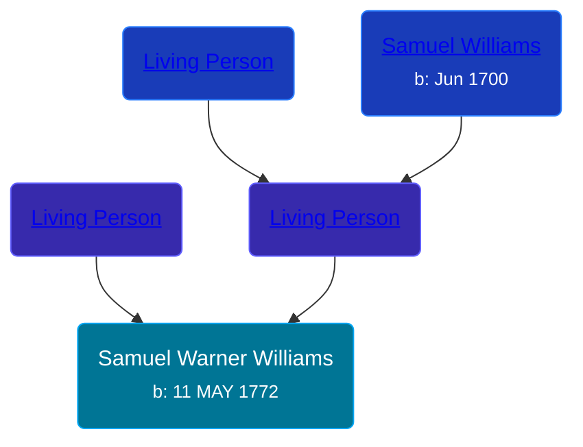

## 🔵 Samuel Warner Williams

Son of [Living Person](/people/5/55971024) and [Living Person](/people/6/62871690)





### 📆 Events


Type | Date | Age at Event | Place
------ | ------ | ------ | ------
[Birth](#event-event-2) | 11 MAY 1772 |  | Connecticut, USA



- **[Birth](#event-event-2)**
**Date**: 11 MAY 1772, Age:
**Place**: Connecticut, USA


### 📰 Event Sources

####  Birth, 11 MAY 1772
* The Town and City of Waterbury, Connecticut  - 154