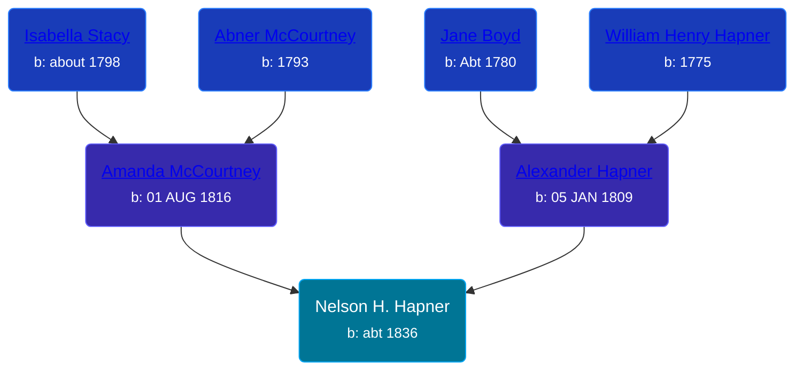

## 🔵 Nelson H. Hapner

Son of [Alexander Hapner](/people/6/68586072) and [Amanda McCourtney](/people/5/56501802)





### 📆 Events


Type | Date | Age at Event | Place
------ | ------ | ------ | ------
Birth | abt 1836 |  | Ohio, USA



- **Birth**
**Date**: abt 1836, Age:
**Place**: Ohio, USA

