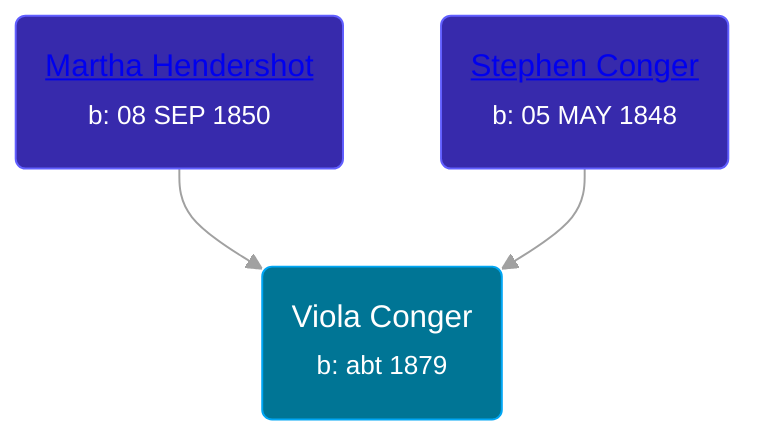

## 🟣 Viola Conger

Daughter of [Stephen Conger](/people/4/42530474) and [Martha Hendershot](/people/6/69252286)





### 📆 Events


Type | Date | Age at Event | Place
------ | ------ | ------ | ------
Birth | abt 1879 |  | Missouri, USA
[Residence](#event-event-0) | 11 JUN 1880 | 1y, 6m, 11d | Windsor, Henry, Missouri, USA



- **Birth**
**Date**: abt 1879, Age:
**Place**: Missouri, USA
- **[Residence](#event-event-0)**
**Date**: 11 JUN 1880, Age: 1y, 6m, 11d
**Place**: Windsor, Henry, Missouri, USA


### 📰 Event Sources

####  Residence, 11 JUN 1880
* 1880 US Census
>   
  > Name: Violia Conger  
  > Age: 1  
  > Birth Date: Abt 1879  
  > Birthplace: Missouri  
  > Home in 1880: Windsor, Henry, Missouri, USA  
  > Dwelling Number: 149  
  > Race: White  
  > Gender: Female  
  > Relation to Head of House: Daughter  
  > Marital Status: Single  
  > Father's Name: Steavin Conger  
  > Father's Birthplace: Ohio  
  > Mother's Name: Martha Conger  
  > Mother's Birthplace: Virginia  
  >   
  > Household members:  
  > - Steavin Conger, 35, Self (Head)  
  > - Martha Conger, 29, Wife  
  > - Juneaetta Conger, 7, Daughter  
  > - Arren Conger, 5, Son  
  > - David Conger, 3, Son  
  > - Violia Conger, 1, Daughter  
  >
