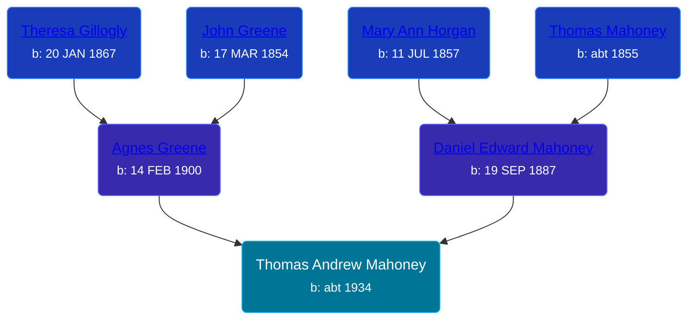

## 🔵 Thomas Andrew Mahoney
<small>Age: 87y, 4m, 15d</small>

Son of [Daniel Edward Mahoney](/people/2/24117676) and [Agnes Greene](/people/1/15565254)





### 📆 Events


Type | Date | Age at Event | Place
------ | ------ | ------ | ------
Birth | abt 1934 |  | Michigan, USA
[Residence](#event-event-0) | 11 APR 1950 | 16y, 4m, 11d | Owosso, Shiawassee, Michigan, USA
[Death](#event-event-4) | 15 APR 2021 | 87y, 4m, 15d |



- **Birth**
**Date**: abt 1934, Age:
**Place**: Michigan, USA
- **[Residence](#event-event-0)**
**Date**: 11 APR 1950, Age: 16y, 4m, 11d
**Place**: Owosso, Shiawassee, Michigan, USA
- **[Death](#event-event-4)**
**Date**: 15 APR 2021, Age: 87y, 4m, 15d
**Place**:


## 👩‍❤️‍👨 Relationships

### 🟣 [Living Person](/people/6/66069279)

#### Children With Living Person
* 🟣 [Living Person](/people/4/43790458)
* 🟣 [Living Person](/people/6/69905952)
* 🟣 [Living Person](/people/4/41983368)
* 🔵 [Living Person](/people/7/70585132)
### 📰 Event Sources

####  Residence, 11 APR 1950
* 1950 US Census
>   
  > Name: Thomas A Manoney  
  > Age: 16  
  > Birth Date: abt 1934  
  > Gender: Male  
  > Race: White  
  > Birth Place: Michigan  
  > Marital Status: Never Married (Single)  
  > Relation to Head of House: Son  
  > Residence Date: 1950  
  > Home in 1950: Owosso, Shiawassee, Michigan, USA  
  > Street Name: Howell  
  > House Number: 206  
  > Apartment Number: Lo  
  > Dwelling Number: 192  
  > Farm: No  
  > Occupation: Pin Setter  
  > Industry: Bowling alley  
  > Occupation Category: Other  
  > Worked Last Week: No  
  > Seeking Work: No  
  > Employment Status: Yes  
  > Worker Class: Private  
  >   
  > Household members:  
  > D. Edward Mahoney, 62, Head  
  > Agnes Mahoney, 50, Wife  
  > Gerald F Mahoney, 19, Son  
  > Philip J Mahoney, 17, Son  
  > Thomas A Mahoney, 16, Son  
  >

####  Death, 15 APR 2021
* desmondfuneralhome.com
>   
  > Thomas Andrew Mahoney Obituary  
  > Thomas Andrew Mahoney passed away on April 15, 2021 at age 87.  
  >   
  > Tom was born November 23, 1933 in Owosso, Michigan, to Agnes (nee Greene) and Daniel Edward Mahoney. Devoted and loving husband of Carol (his wife of 60 years), dear father of Thomas J. (Caroline), Pamela (Alexander) Tsigdinos, Barbara and Susan. Cherished grandfather of Madeline and Trevor. He was predeceased by brothers Gerald and Philip and is survived by numerous nieces and nephews.  
  >   
  > A gifted writer and singer, Tom always had a song in his heart or a kind word to share with all who were blessed to know him. Laughter came easily and often. Tom effortlessly charmed and engaged in conversation with a playfulness and passion that dazzled those around him.  
  >   
  > As a child he served alongside his brothers as an altar boy at St. Paul’s Church in Owosso. Adventurous and devoted to service, Tom enlisted in the Air Force, while still in his late teens, within a year of graduating from St. Paul’s high school in 1951. After boot camp, Airman Mahoney served in Korea, just south of Seoul. He was there for a year, arriving shortly after the "cessation of hostilities." His job was tracking aircraft, their crews, and mechanics.  
  >   
  > He was next posted to Tokyo, Japan. It was here he started his college career, taking a total of four courses in the evenings at Sophia University, a Jesuit institution. Staff Sergeant Mahoney returned stateside to finish the final six months of his enlistment serving at an air base in Lincoln, Nebraska, before relocating to Detroit.  
  >   
  > With the help of the GI bill, he registered at the University of Detroit, where a new and defining chapter of his life began. He joined the staff of the Varsity News and quickly rose to editorial director. Tom met Carol, a Varsity News staff writer, soon to become the society editor. Their adjoining desks allowed them to trade humorous observations and headlines. A chance encounter at the student union in 1960 re-introduced them just prior to their graduation. They soon began their courtship, which included effortless dancing to all styles of music, including the cha-cha and swing. They also enjoyed Ella Fitzgerald concerts, trips to the movies and parties with friends. Six months later he proposed. They married May 6, 1961.  
  >   
  > Words were a defining feature of Tom’s life. On their honeymoon in the parlor car on a train to Chicago, Tom confidently and easily completed The New York Times crossword puzzle in ink – leaving fellow passengers awe-struck.  
  >   
  > Tom and Carol joyfully settled into married life and welcomed four children in five years. The patriarch lavished attention on his family and routinely told his wife, “you can’t put a price on family.” He accepted his wife and children with love. A critical word never crossed his lips.  
  >   
  > Tom’s career spanned journalism, advertising, and marketing before he rose to the position of Executive Editor at the national weekly trade journal, Air Conditioning, Heating and Refrigeration News. A wordsmith of the highest order, he could transform the most mundane business developments into must-read copy. His weekly “Mahoney’s Market Memos” column led to many devoted readers and made him a coveted speaker at industry conferences and events around the country. If Tom was on the agenda, the organizers knew he would fill the room.  
  >   
  > When off the job, he eagerly pursued a number of hobbies. He enthusiastically participated in community theater playing a central character in the play, Forty Carats, put on by the Warren Players and later engaged an instructor to teach him how to play the piano. He assisted at his son’s baseball games, was a lifelong Detroit Lions and Detroit Tigers fan and ‘coached’ his family in an annual softball game while vacationing with family friends in northern Michigan.  
  >   
  > Tom and Carol were competitive and talented bridge and tennis players. They were also deeply involved with St. Hugo of the Hills Catholic church, where they have been members for 48 years. Tom happily joined the church choir where he delighted his fellow singers with his innate ability to sing harmony. In 1989, he and his wife were able to travel with the choir to the Vatican, where the choir sang for Pope John Paul II in a papal audience. This was one of many trips Tom and Carol took around the world for business and pleasure.  
  >   
  > A voracious reader (he was easily and often recognized at the Bloomfield Township Library), Tom never lost his appetite for biographies, fiction or non-fiction. When retired, he tried his hand at novel writing delighting in the formation of characters and plot lines.  
  >   
  > His children benefited greatly from his expansive vocabulary and attention to grammar. He often volunteered to review and make editorial suggestions for their school writing assignments. Everyday family dinners always involved lively discussions of current events, movies, and amusing stories. All four of his children went on to study English, journalism, and advertising.  
  >   
  > Family has always been Tom’s priority. He keenly pursued genealogy, attended extended family reunions and showed endless interest in his relative’s pursuits. He lovingly cared for his mother, mother-in-law and later doted on his grandchildren. Tom will be dearly missed.  
  >   
  > A Mass of Catholic Burial and Inurnment will be held on Tuesday, April 27, 2021 at 11:00 AM at St. Hugo of the Hills Catholic Church, 2215 Opdyke Rd. Bloomfield Hills. The Mahoney family will greet visitors from 10:30 AM at the church. In lieu of flowers, memorial contributions in Thomas’s memory may be made to the University of Detroit-Mercy or the Wounded Warriors.  
  >   
  > Thank you for keeping the Mahoney family in your thoughts and prayers at this sad time.
