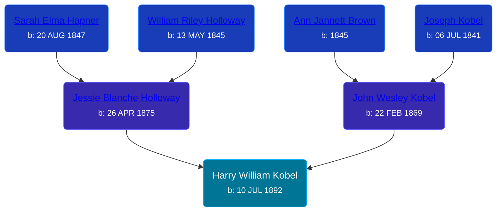

## 🔵 Harry William Kobel
<small>Age: 87y, 10m, 24d</small>

Son of [John Wesley Kobel](/people/2/24649136) and [Jessie Blanche Holloway](/people/2/29242864)





### 📆 Events


Type | Date | Age at Event | Place
------ | ------ | ------ | ------
[Birth](#event-event-2) | 10 JUL 1892 |  | Warner Township, Antrim, Michigan, USA
[Residence](#event-event-0) | 01 JUN 1900 | 7y, 10m, 21d | Warner Township, Antrim, Michigan, USA
[Residence](#event-event-1) | 1910 | 17y, 4m, 20d | Deerfield Township, Isabella, Michigan, USA
[Residence](#event-event-2) | 08 JAN 1920 | 27y, 5m, 28d | Warner Township, Antrim, Michigan, USA
[Residence](#event-event-3) | 05 APR 1930 | 37y, 8m, 25d | Chestonia Township, Antrim, Michigan, USA
[Residence](#event-event-4) | 02 APR 1940 | 47y, 8m, 22d | Star, Antrim, Michigan, USA
[Death](#event-event-8) | 04 JUN 1980 | 87y, 10m, 24d | Gladwin, Gladwin, Michigan, United States
[Burial](#event-event-9) |  |  | Midland Memorial Gardens, Midland, Midland, Michigan, USA



- **[Birth](#event-event-2)**
**Date**: 10 JUL 1892, Age:
**Place**: Warner Township, Antrim, Michigan, USA
- **[Residence](#event-event-0)**
**Date**: 01 JUN 1900, Age: 7y, 10m, 21d
**Place**: Warner Township, Antrim, Michigan, USA
- **[Residence](#event-event-1)**
**Date**: 1910, Age: 17y, 4m, 20d
**Place**: Deerfield Township, Isabella, Michigan, USA
- **[Residence](#event-event-2)**
**Date**: 08 JAN 1920, Age: 27y, 5m, 28d
**Place**: Warner Township, Antrim, Michigan, USA
- **[Residence](#event-event-3)**
**Date**: 05 APR 1930, Age: 37y, 8m, 25d
**Place**: Chestonia Township, Antrim, Michigan, USA
- **[Residence](#event-event-4)**
**Date**: 02 APR 1940, Age: 47y, 8m, 22d
**Place**: Star, Antrim, Michigan, USA
- **[Death](#event-event-8)**
**Date**: 04 JUN 1980, Age: 87y, 10m, 24d
**Place**: Gladwin, Gladwin, Michigan, United States
- **[Burial](#event-event-9)**
**Date**:
**Place**: Midland Memorial Gardens, Midland, Midland, Michigan, USA


## 👩‍❤️‍👨 Relationships

### 🟣 [Edna Gertrude Long](/people/3/33710863), b. 02 OCT 1897

#### Events


Type | Date | Age at Event | Place
------ | ------ | ------ | ------
Marriage | 20 OCT 1913 | 21y, 3m, 10d | Mount Pleasant, Isabella, Michigan, USA



- **Marriage**
**Date**: 20 OCT 1913, Age: 21y, 3m, 10d
**Place**: Mount Pleasant, Isabella, Michigan, USA


#### Children With Edna Gertrude Long
* 🔵 [Clifford H. Kobel](/people/2/28732388), b. 27 JUL 1914
* 🟣 [Vedah Verla Kobel](/people/6/67698772), b. 09 MAY 1916
* 🟣 [Erma Violet Kobel](/people/9/97335746), b. 26 AUG 1919
* 🟣 [Living Person](/people/4/49691942)
* 🔵 [Living Person](/people/2/26156627)
* 🔵 [Living Person](/people/3/32391326)
### 📰 Event Sources

####  Birth, 10 JUL 1892
* U.S., World War I Draft Registration Cards, 1917-1918
* U.S., World War II Draft Registration Cards, 1942

####  Residence, 01 JUN 1900
* 1900 US Census

####  Residence, 1910
* 1910 US Census

####  Residence, 08 JAN 1920
* 1920 US Census
>   
  > Name: Harry Kobel  
  > Age: 27  
  > Birth Year: abt 1893  
  > Birthplace: Michigan  
  > Home in 1920: Wamer, Antrim, Michigan  
  > House Number: Farm  
  > Residence Date: 1920  
  > Race: White  
  > Gender: Male  
  > Relation to Head of House: Head  
  > Marital Status: Married  
  > Spouse's Name: Edna Kobel  
  > Father's Birthplace: Michigan  
  > Mother's Birthplace: Michigan  
  > Able to Speak English: Yes  
  > Occupation: Farmer  
  > Industry: General farming  
  > Employment Field: Own Account  
  > Home Owned or Rented: Owned  
  > Home Free or Mortgaged: Mortgaged  
  > Able to read: Yes  
  > Able to Write: Yes

####  Residence, 05 APR 1930
* 1930 US Census

####  Residence, 02 APR 1940
* 1940 US Census

####  Death, 04 JUN 1980
* U.S., Social Security Death Index, 1935-2014
>   
  > Name: HARRY KOBEL  
  > Birth: 10 Jul 1892  
  > Death: Jun 1980  
  > Last Residence: 48624 (Gladwin, Gladwin, MI)  
  > Last Benefit: 48624 (Gladwin, Gladwin, MI)  
  > SSN: ###-##-####  
  > Issued: Michigan
* Michigan Deaths, 1971-1996
>   
  > Name:  Harry W Kobel  
  > Birth Date: 10 Jul 1992  
  > Death Date: 4 Jun 1980  
  > Gender: Male  
  > Residence: Gladwin, Gladwin, Michigan  
  > Place of Death: Gladwin, Gladwin, Michigan

####  Burial
* findagrave.com
####  Marriage, 20 OCT 1913
