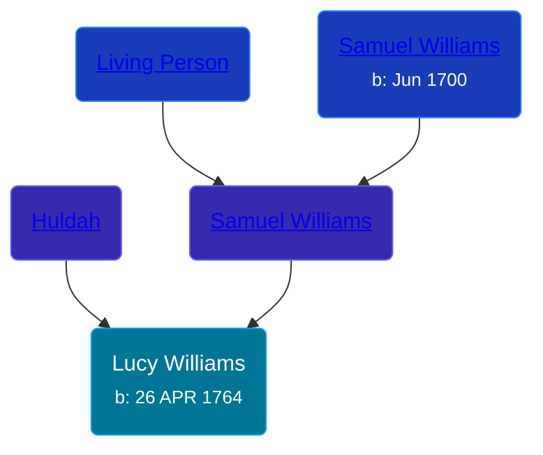

## 🟣 Lucy Williams

Daughter of [Samuel Williams](/people/5/55971024) and [Huldah ](/people/6/62871690)





### 📆 Events


Type | Date | Age at Event | Place
------ | ------ | ------ | ------
[Birth](#event-event-2) | 26 APR 1764 |  |



- **[Birth](#event-event-2)**
**Date**: 26 APR 1764, Age:
**Place**:


### 📰 Event Sources

####  Birth, 26 APR 1764
* The Town and City of Waterbury, Connecticut  - 154