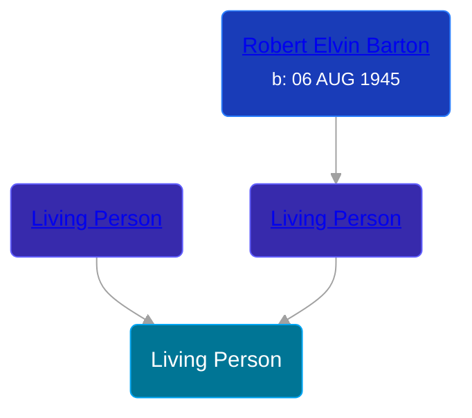

## 🔵 Living Person

Son of [Living Person](/people/5/55705994) and [Living Person](/people/5/51377024)



```mermaid
graph
classDef grands fill:#193cb8,stroke:#2b7fff,stroke-width:1px,color:#fff;
classDef parents fill:#372aac,stroke:#615fff,stroke-width:1px,color:#fff;
classDef primary fill:#007595,stroke:#00a6f4,stroke-width:1px,color:#fff;
31304063(Living Person):::primary
51377024(<a class="text-white" href="/people/5/51377024">Living Person</a>):::parents-->31304063
55705994(<a class="text-white" href="/people/5/55705994">Living Person</a>):::parents-->31304063
48782300(<a class="text-white" href="/people/4/48782300">Robert Elvin Barton</a><br /><small>b: 06 AUG 1945</small>):::grands-->55705994
linkStyle default stroke:#a1a1a1
```

