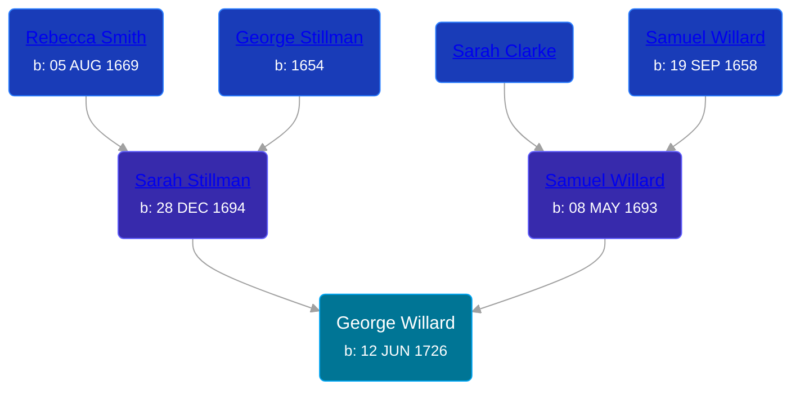

## 🔵 George Willard

Son of [Samuel Willard](/people/1/12362566) and [Sarah Stillman](/people/9/9722974)





### 📆 Events


Type | Date | Age at Event | Place
------ | ------ | ------ | ------
[Birth](#event-event-2) | 12 JUN 1726 |  |



- **[Birth](#event-event-2)**
**Date**: 12 JUN 1726, Age:
**Place**:


### 📰 Event Sources

####  Birth, 12 JUN 1726
* The Foote Family: or the Descendants of Nathaniel Foote  - 283