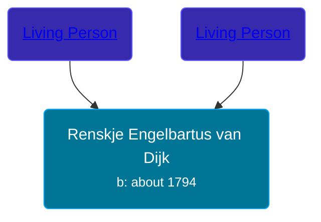

## 🟣 Renskje Engelbartus van Dijk

Daughter of [Living Person](/people/8/81341914) and [Living Person](/people/4/49062305)





### 📆 Events


Type | Date | Age at Event | Place
------ | ------ | ------ | ------
Birth | about 1794 |  | Doezum, Groningen, Netherlands



- **Birth**
**Date**: about 1794, Age:
**Place**: Doezum, Groningen, Netherlands


## 👩‍❤️‍👨 Relationships

### 🔵 [Einte Wolters Postma](/people/1/18880768), b. 1795

#### Events


Type | Date | Age at Event | Place
------ | ------ | ------ | ------
[Marriage](#event-family-0-event-0) | 04 MAY 1839 | 45y, 5m, 4d |



- **[Marriage](#event-family-0-event-0)**
**Date**: 04 MAY 1839, Age: 45y, 5m, 4d
**Place**:


### 📰 Event Sources

####  Marriage, 04 MAY 1839
* Dutch Civil Register
>   
  > Groom: Einte Wolters Postma  
  > Place of birth: Duurswoude, gemeente Opsterland  
  > Age: 43  
  > Father of the groom: Wolter Wolters Postma  
  > Mother of the groom: Trijntje Tjipkes  
  > Bride: Renskje Engelbartus van Dijk  
  > Place of birth: Doezum, provincie Groningen  
  > Age: 45  
  > Father of the bride: Engelbartus van Dijk  
  > Mother of the bride: Grietje Elferink  
  > Event: Huwelijk  
  > Date: Saturday, May 04, 1839  
  > Event place: Achtkarspelen