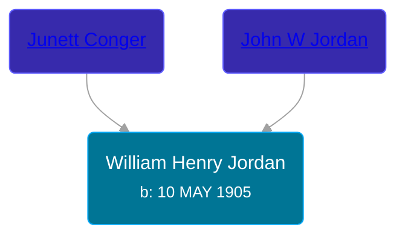

## 🔵 William Henry Jordan
<small>Age: 55y, 3m, 17d</small>

Son of [John W Jordan](/people/9/97595723) and [Junett Conger](/people/5/55321016)





### 📆 Events


Type | Date | Age at Event | Place
------ | ------ | ------ | ------
Birth | 10 MAY 1905 |  | Nebraska, USA
[Residence](#event-event-0) | 1935 | 29y, 6m, 20d | Sioux City, Woodbury, Iowa, USA
[Residence](#event-event-1) | 18 APR 1940 | 34y, 11m, 8d | Sioux City, Woodbury, Iowa, USA
[Death](#event-event-5) | 27 AUG 1960 | 55y, 3m, 17d | Sioux City, Woodbury, Iowa, USA
[Burial](#event-event-6) | 30 AUG 1960 | 55y, 3m, 20d | Calvary Cemetery, Sioux City, Woodbury, Iowa, USA



- **Birth**
**Date**: 10 MAY 1905, Age:
**Place**: Nebraska, USA
- **[Residence](#event-event-0)**
**Date**: 1935, Age: 29y, 6m, 20d
**Place**: Sioux City, Woodbury, Iowa, USA
- **[Residence](#event-event-1)**
**Date**: 18 APR 1940, Age: 34y, 11m, 8d
**Place**: Sioux City, Woodbury, Iowa, USA
- **[Death](#event-event-5)**
**Date**: 27 AUG 1960, Age: 55y, 3m, 17d
**Place**: Sioux City, Woodbury, Iowa, USA
- **[Burial](#event-event-6)**
**Date**: 30 AUG 1960, Age: 55y, 3m, 20d
**Place**: Calvary Cemetery, Sioux City, Woodbury, Iowa, USA


## 👩‍❤️‍👨 Relationships

### 🟣 [Anna Catherine Hardy](/people/2/25919759), b. 19 MAY 1914

#### Children With Anna Catherine Hardy
* 🔵 [Living Person](/people/7/71455712)
* 🟣 [Living Person](/people/8/81156064)
* 🟣 [Patricia Jane Jordan](/people/8/8578400), b. 14 JAN 1936
* 🟣 [Living Person](/people/1/16458922)
* 🟣 [Joyce Elaine Jordan](/people/8/86240475), b. 18 MAY 1939
### 📰 Event Sources

####  Residence, 1935
* 1940 US Census

####  Residence, 18 APR 1940
* 1940 US Census

####  Death, 27 AUG 1960
* Iowa, U.S., Death Records, 1880-1968
>   
  > Name: William Henry Jordan  
  > Gender: Male  
  > Race: White  
  > Age: 55  
  > Birth Date: 10 May 1905  
  > Death Date: 27 Aug 1960  
  > Death Place: Sioux City, Woodbury, Iowa, USA  
  > Burial Date: 30 Aug 1960  
  > Burial Place: Sioux City, Iowa  
  > Father: John W Jordan  
  > Mother: Junett Conger  
  > Certificate Number: 60-19079  
  >

####  Burial, 30 AUG 1960
* findagrave.com
