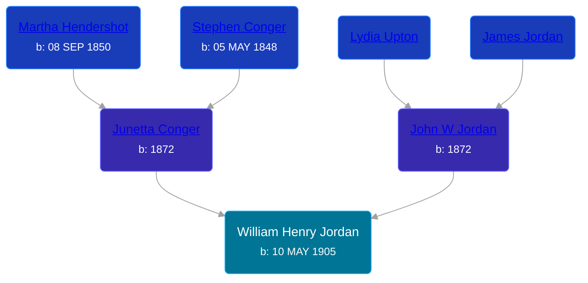

## 🔵 William Henry Jordan
<small>Age: 55y, 3m, 17d</small>

Son of [John W Jordan](/people/9/97595723) and [Junetta Conger](/people/5/55321016)



```mermaid
graph
classDef grands fill:#193cb8,stroke:#2b7fff,stroke-width:1px,color:#fff;
classDef parents fill:#372aac,stroke:#615fff,stroke-width:1px,color:#fff;
classDef primary fill:#007595,stroke:#00a6f4,stroke-width:1px,color:#fff;
32091032(William Henry Jordan<br /><small>b: 10 MAY 1905</small>):::primary
55321016(<a class="text-white" href="/people/5/55321016">Junetta Conger</a><br /><small>b: 1872</small>):::parents-->32091032
69252286(<a class="text-white" href="/people/6/69252286">Martha Hendershot</a><br /><small>b: 08 SEP 1850</small>):::grands-->55321016
42530474(<a class="text-white" href="/people/4/42530474">Stephen Conger</a><br /><small>b: 05 MAY 1848</small>):::grands-->55321016
97595723(<a class="text-white" href="/people/9/97595723">John W Jordan</a><br /><small>b: 1872</small>):::parents-->32091032
79955568(<a class="text-white" href="/people/7/79955568">Lydia Upton</a>):::grands-->97595723
85897272(<a class="text-white" href="/people/8/85897272">James Jordan</a>):::grands-->97595723
linkStyle default stroke:#a1a1a1
```


### 📆 Events


Type | Date | Age at Event | Place
------ | ------ | ------ | ------
[Birth](#event-event-2) | 10 MAY 1905 |  | Nebraska, USA
[Residence](#event-event-0) | 27 APR 1910 | 4y, 11m, 17d | Central, Knox, Nebraska, USA
[Residence](#event-event-1) | 1935 | 29y, 6m, 20d | Sioux City, Woodbury, Iowa, USA
[Residence](#event-event-2) | 18 APR 1940 | 34y, 11m, 8d | Sioux City, Woodbury, Iowa, USA
[Residence](#event-event-3) | 04 APR 1950 | 44y, 10m, 24d | Sioux City, Woodbury, Iowa, USA
[Death](#event-event-7) | 27 AUG 1960 | 55y, 3m, 17d | Sioux City, Woodbury, Iowa, USA
[Burial](#event-event-8) | 30 AUG 1960 | 55y, 3m, 20d | Calvary Cemetery, Sioux City, Woodbury, Iowa, USA



- **[Birth](#event-event-2)**
**Date**: 10 MAY 1905, Age:
**Place**: Nebraska, USA
- **[Residence](#event-event-0)**
**Date**: 27 APR 1910, Age: 4y, 11m, 17d
**Place**: Central, Knox, Nebraska, USA
- **[Residence](#event-event-1)**
**Date**: 1935, Age: 29y, 6m, 20d
**Place**: Sioux City, Woodbury, Iowa, USA
- **[Residence](#event-event-2)**
**Date**: 18 APR 1940, Age: 34y, 11m, 8d
**Place**: Sioux City, Woodbury, Iowa, USA
- **[Residence](#event-event-3)**
**Date**: 04 APR 1950, Age: 44y, 10m, 24d
**Place**: Sioux City, Woodbury, Iowa, USA
- **[Death](#event-event-7)**
**Date**: 27 AUG 1960, Age: 55y, 3m, 17d
**Place**: Sioux City, Woodbury, Iowa, USA
- **[Burial](#event-event-8)**
**Date**: 30 AUG 1960, Age: 55y, 3m, 20d
**Place**: Calvary Cemetery, Sioux City, Woodbury, Iowa, USA


## 👩‍❤️‍👨 Relationships

### 🟣 [Anna Catherine Hardy](/people/2/25919759), b. 19 MAY 1914

#### Children With Anna Catherine Hardy
* 🔵 [Living Person](/people/7/71455712)
* 🟣 [Living Person](/people/8/81156064)
* 🟣 [Patricia Jane Jordan](/people/8/8578400), b. 14 JAN 1936
* 🟣 [Living Person](/people/1/16458922)
* 🟣 [Joyce Elaine Jordan](/people/8/86240475), b. 18 MAY 1939
* 🟣 [Janice Loraine Jordan](/people/8/83725048), b. 20 APR 1941
### 📰 Event Sources

####  Birth, 10 MAY 1905
* U.S., World War II Draft Registration Cards, 1942
>
  > Serial Number: 1182
  > Name: William Henry Jordan
  > Address: 210 11th St, Sioux City, Wood, IA
  > Telephone: none
  > Age in years: 36
  > Place of Birth: Pilger, Stanton, Neb
  > Date of Birth: 5-10-05
  > Country of Citizenship: U.S.
  > Name of person who will always know your address:
  > Mrs. An Jordan
  > 210 11st Sioux City, Wood, Iowa
  > Relationship of that person: Wife
  > Employers name: Sioux City Stock yards Co
  > Place of employment or business:
  > Chambers St, Sioux City, Wod, IA

####  Residence, 27 APR 1910
* 1910 US Census
>
  > Name: Willie Jordan
  > Age in 1910: 5
  > Birth Date: 1905
  > Birthplace: Kansas
  > Home in 1910: Central, Knox, Nebraska, USA
  > Sheet Number: 5b
  > Race: White
  > Gender: Male
  > Relation to Head of House: Son
  > Marital Status: Single
  > Father's Birthplace: Indiana Territory
  > Mother's Birthplace: Missouri
  > Native Tongue: English
  > Attended School: Y
  > Able to read: Y
  > Able to Write: Y
  > Enumeration District Number: 0113
  > Enumerated Year: 1910
  >
  > Household members:
  > - John Jordan, 39, Head
  > - Etta Jordan, 38, Wife
  > - May Jordan, 17, Daughter
  > - Pearl Jordan, 15, Daughter
  > - David Jordan, 12, Son
  > - Ralph Jordan, 8, Son
  > - Willie Jordan, 5, Son
  > - Nellie Jordan, 2, Daughter
  >

####  Residence, 1935
* 1940 US Census

####  Residence, 18 APR 1940
* 1940 US Census

####  Residence, 04 APR 1950
* 1950 US Census
>
  > Name: William H Jordan
  > Age: 45
  > Birth Date: abt 1905
  > Gender: Male
  > Race: White
  > Birth Place: Nebraska
  > Relation to Head of House: Head
  > Residence Date: 1950
  > Home in 1950: Sioux City, Woodbury, Iowa, USA
  > Street Name: 10th St
  > House Number: 210
  > Dwelling Number: 245
  > Farm: No
  > Acres: No
  > Occupation: Runs wash rack
  > Industry: Stock Yards
  > Father Birth Place: USA
  > Mother Birth Place: USA
  > Occupation Category: Working
  > Hours Worked: 48
  > Same House: Yes
  > School Completed: S6
  > Grade Completed: Yes
  > Weeks Worked: 52
  > Income: 3700
  > Other Income: none
  > Supplemental Income: none
  > Relative Income: 2400
  > Relative Other Income: none
  > World War II Veteran: No
  > Veteran: No
  >
  > Household members:
  > - William H Jordan, 45, Head
  > - Anna C Jordan, 35, Wife
  > - Robert E Jordan, 18, Son
  > - Mary Anne Jordan, 15, Daughter
  > - Patricia J Jordan, 14, Daughter
  > - Margaret C Jordan, 12, Daughter
  > - Joyce Elaine Jordan, 10, Daughter
  >

####  Death, 27 AUG 1960
* Iowa, U.S., Death Records, 1880-1968
>
  > Name: William Henry Jordan
  > Gender: Male
  > Race: White
  > Age: 55
  > Birth Date: 10 May 1905
  > Death Date: 27 Aug 1960
  > Death Place: Sioux City, Woodbury, Iowa, USA
  > Burial Date: 30 Aug 1960
  > Burial Place: Sioux City, Iowa
  > Father: John W Jordan
  > Mother: Junett Conger
  > Certificate Number: 60-19079
  >

####  Burial, 30 AUG 1960
* findagrave.com