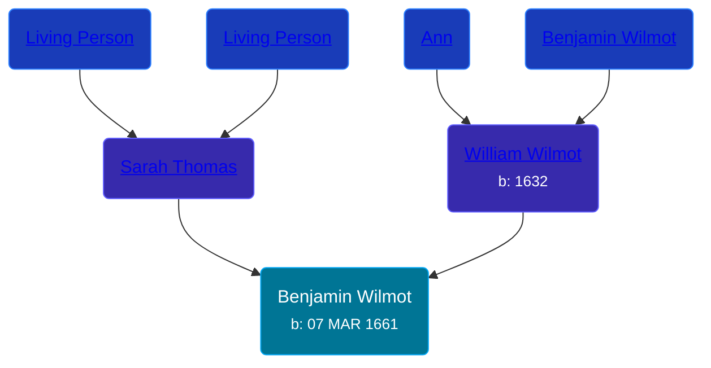

## 🔵 Benjamin Wilmot
<small>Age: 66y, 8m, 23d</small>

Son of [William Wilmot](/people/4/47205976) and [Sarah Thomas](/people/2/28506175)





### 📆 Events


Type | Date | Age at Event | Place
------ | ------ | ------ | ------
[Birth](#event-event-2) | 07 MAR 1661 |  |
[Death](#event-event-3) | 1728 | 66y, 8m, 23d |



- **[Birth](#event-event-2)**
**Date**: 07 MAR 1661, Age:
**Place**:
- **[Death](#event-event-3)**
**Date**: 1728, Age: 66y, 8m, 23d
**Place**:


### 📰 Event Sources

####  Birth, 07 MAR 1661
* The New England Historical and Genealogical Register  - 68

####  Death, 1728
* The New England Historical and Genealogical Register  - 69