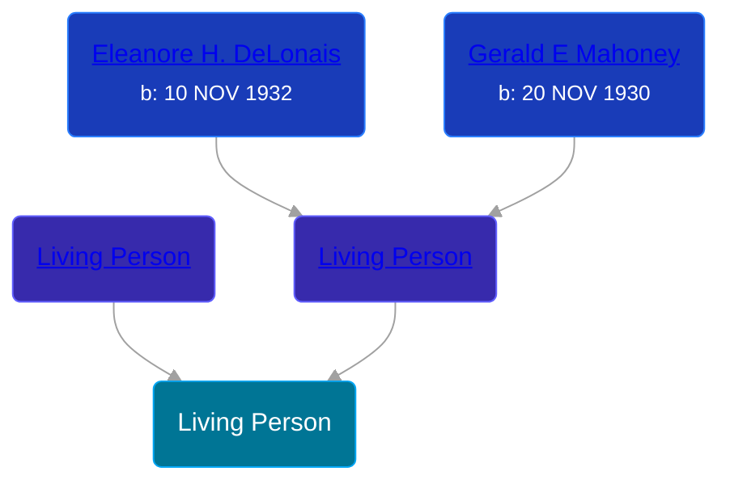

## 🔵 Living Person

Son of [Living Person](/people/5/57716919) and [Living Person](/people/3/31854954)



```mermaid
graph
classDef grands fill:#193cb8,stroke:#2b7fff,stroke-width:1px,color:#fff;
classDef parents fill:#372aac,stroke:#615fff,stroke-width:1px,color:#fff;
classDef primary fill:#007595,stroke:#00a6f4,stroke-width:1px,color:#fff;
32171204(Living Person):::primary
31854954(<a class="text-white" href="/people/3/31854954">Living Person</a>):::parents-->32171204
57716919(<a class="text-white" href="/people/5/57716919">Living Person</a>):::parents-->32171204
45463626(<a class="text-white" href="/people/4/45463626">Eleanore H. DeLonais</a><br /><small>b: 10 NOV 1932</small>):::grands-->57716919
10062624(<a class="text-white" href="/people/1/10062624">Gerald E Mahoney</a><br /><small>b: 20 NOV 1930</small>):::grands-->57716919
linkStyle default stroke:#a1a1a1
```

