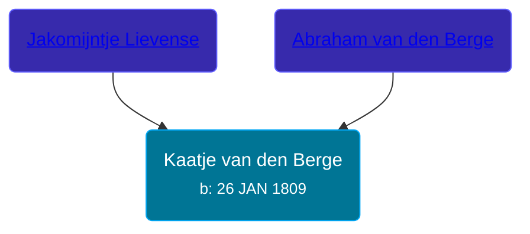

## 🟣 Kaatje van den Berge
<small>Age: 77y, 10m, 5d</small>

Daughter of [Abraham van den Berge](/people/7/78829556) and [Jakomijntje Lievense](/people/7/7376448)





### 📆 Events


Type | Date | Age at Event | Place
------ | ------ | ------ | ------
[Birth](#event-event-3) | 26 JAN 1809 |  | Dreischor, Zeeland, Netherlands
[Death](#event-event-4) | 01 DEC 1886 | 77y, 10m, 5d | Zierikzee, Zeeland, Netherlands



- **[Birth](#event-event-3)**
**Date**: 26 JAN 1809, Age:
**Place**: Dreischor, Zeeland, Netherlands
- **[Death](#event-event-4)**
**Date**: 01 DEC 1886, Age: 77y, 10m, 5d
**Place**: Zierikzee, Zeeland, Netherlands


## 👩‍❤️‍👨 Relationships

### 🔵 [Joost Geelhoed](/people/7/72031888), b. 19 FEB 1804

#### Events


Type | Date | Age at Event | Place
------ | ------ | ------ | ------
[Marriage](#event-family-0-event-0) | 23 FEB 1831 | 22y, 27d | Dreischor, Zeeland, Netherlands



- **[Marriage](#event-family-0-event-0)**
**Date**: 23 FEB 1831, Age: 22y, 27d
**Place**: Dreischor, Zeeland, Netherlands


#### Children With Joost Geelhoed
* 🔵 [Maarten Geelhoed](/people/5/57272382), b. 30 AUG 1831
* 🔵 [Abraham Geelhoed](/people/1/12826628), b. 17 SEP 1832
* 🔵 [Abraham Geelhoed](/people/9/990506), b. 14 NOV 1833
* 🔵 [Maarten Geelhoed](/people/2/23159760), b. 14 MAY 1835
* 🔵 [Jan Geelhoed](/people/2/29775472), b. 28 OCT 1836
* 🟣 [Jacomina Geelhoed](/people/3/37405220), b. 04 NOV 1837
* 🔵 [Jan Geelhoed](/people/6/66365467), b. 20 JUN 1840
* 🔵 [Adriaan Geelhoed](/people/8/86821084), b. 06 JAN 1843
* 🔵 [Joost Geelhoed](/people/7/73673934), b. 12 OCT 1845
* 🔵 [Cornelis Geelhoed](/people/1/16991740), b. 09 JAN 1850
* 🟣 [Joppa Geelhoed](/people/6/60925262), b. 02 AUG 1854
### 📰 Event Sources

####  Birth, 26 JAN 1809
* Geelhoet, Geelhoed & Geelhoedt Genealogie  - 139

####  Marriage, 23 FEB 1831
* Geelhoet, Geelhoed & Geelhoedt Genealogie  - 139
* Dutch Civil Register
>   
  > Source Civil register - Marriage  
  > Archive location: Zeeuws Archief  
  > General Number of finding aid: 25.25  
  > Municipality: Dreischor  
  > Type of record: Huwelijksakte  
  > Record number: 2  
  > Registration date: 23-02-1831  
  > Groom: Joost Geelhoed  
  > Age: 26  
  > Place of birth: Dreischor  
  > Bride: Kaatje van den Berge  
  > Age: 22  
  > Place of birth: Dreischor  
  > Father groom: Maarten Geelhoed  
  > Mother groom: Joppa Kort  
  > Father bride: Abraham van den Berge  
  > Mother bride: Jakomijntje Lievense
####  Death, 01 DEC 1886
* Geelhoet, Geelhoed & Geelhoedt Genealogie  - 139
