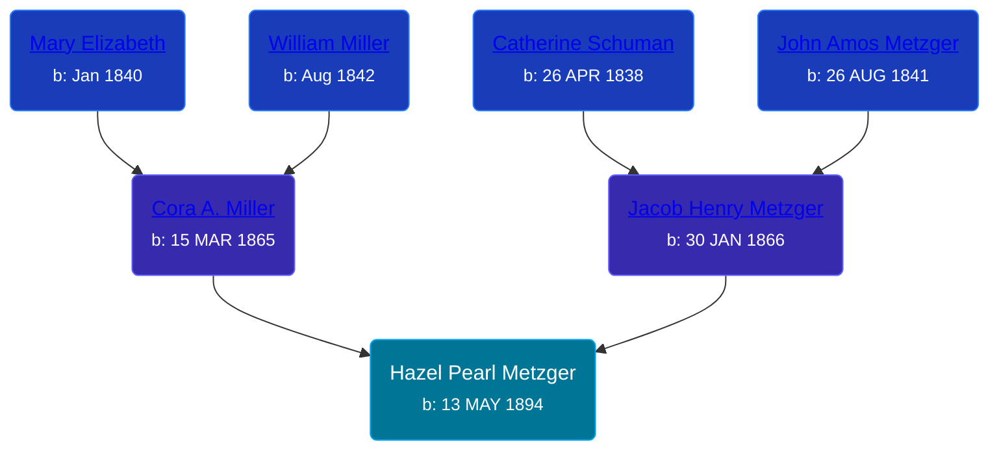

## 🟣 Hazel Pearl Metzger
<small>Age: 90y, 9m, 21d</small>

Daughter of [Jacob Henry Metzger](/people/1/13773745) and [Cora A. Miller](/people/1/12053368)





### 📆 Events


Type | Date | Age at Event | Place
------ | ------ | ------ | ------
[Birth](#event-event-2) | 13 MAY 1894 |  | Columbia City, Whitley, Indiana, USA
[Residence](#event-event-0) | 21 JUN 1900 | 6y, 1m, 8d | Richland, Whitley, Indiana, USA
[Residence](#event-event-1) | 27 APR 1910 | 15y, 11m, 14d | Columbia, Whitley, Indiana, USA
Death | 04 MAR 1985 | 90y, 9m, 21d | Pulaski, Giles, Tennessee, USA
[Burial](#event-event-6) |  |  | Maplewood Cemetery, Pulaski, Giles, Tennessee, USA



- **[Birth](#event-event-2)**
**Date**: 13 MAY 1894, Age:
**Place**: Columbia City, Whitley, Indiana, USA
- **[Residence](#event-event-0)**
**Date**: 21 JUN 1900, Age: 6y, 1m, 8d
**Place**: Richland, Whitley, Indiana, USA
- **[Residence](#event-event-1)**
**Date**: 27 APR 1910, Age: 15y, 11m, 14d
**Place**: Columbia, Whitley, Indiana, USA
- **Death**
**Date**: 04 MAR 1985, Age: 90y, 9m, 21d
**Place**: Pulaski, Giles, Tennessee, USA
- **[Burial](#event-event-6)**
**Date**:
**Place**: Maplewood Cemetery, Pulaski, Giles, Tennessee, USA


## 👩‍❤️‍👨 Relationships

### 🔵 [Merrett Miner](/people/1/16338212), b. 19 JAN 1887

#### Events


Type | Date | Age at Event | Place
------ | ------ | ------ | ------
[Marriage](#event-family-0-event-0) | 21 SEP 1912 | 18y, 4m, 8d | Whitley, Indiana, USA



- **[Marriage](#event-family-0-event-0)**
**Date**: 21 SEP 1912, Age: 18y, 4m, 8d
**Place**: Whitley, Indiana, USA


#### Children With Merrett Miner
* 🟣 [Living Person](/people/5/57825613)
### 📰 Event Sources

####  Birth, 13 MAY 1894
* U.S., Social Security Applications and Claims Index, 1936-2007
>   
  > Name:Hazel Pearl Miner  
  > [Hazel Pearl Metzger]   
  > Gender:Female  
  > Race:White  
  > Birth Date:13 May 1894  
  > Birth Place:Columbia City, Indiana  
  > [Columbia Cit]   
  > Father:Jacob Metzger  
  > Mother:Cora Miller  
  > Type of Claim:Original SSN.  
  > Notes:Apr 1955: Name listed as HAZEL PEARL MINER
* Indiana, Select Births and Christenings, 1773-1933
>   
  > Name:Hazel P. 'Metger  
  > [Hazel P. Metzger]   
  > Gender:Female  
  > Birth Date:13 May 1894  
  > Birth Place:Whitley Co , Ind  
  > Father:Jacob H. Metzger  
  > Mother:Cora Miller  
  > FHL Film Number:1710717

####  Residence, 21 JUN 1900
* 1900 US Census
>   
  > Name: Hazel Metzger  
  > Age: 6  
  > Birth Date: May 1894  
  > Birthplace: Indiana, USA  
  > Home in 1900: Richland, Whitley, Indiana  
  > Sheet Number: 13  
  > Number of Dwelling in Order of Visitation: 293  
  > Family Number: 298  
  > Race: White  
  > Gender: Female  
  > Relation to Head of House: Daughter  
  > Marital Status: Single  
  > Father's Name: Jacob Metzger  
  > Father's Birthplace: Ohio, USA  
  > Mother's Name: Cora Metzger  
  > Mother's Birthplace: Indiana, USA

####  Residence, 27 APR 1910
* 1910 US Census
>   
  > Name: Hazel P Metzger  
  > Age in 1910: 16  
  > Birth Date: 1894  
  > Birthplace: Indiana  
  > Home in 1910: Columbia, Whitley, Indiana, USA  
  > Race: White  
  > Gender: Female  
  > Relation to Head of House: Daughter  
  > Marital Status: Single  
  > Father's Name: Jacob H Metzger  
  > Father's Birthplace: Ohio  
  > Mother's Name: Cora Metzger  
  > Mother's Birthplace: Indiana  
  > Native Tongue: English  
  > Attended School: No  
  > Able to read: Yes  
  > Able to Write: Yes

####  Burial
* findagrave.com

####  Marriage, 21 SEP 1912
* Indiana, Select Marriages Index, 1748-1993
>   
  > Name:Hazel P. Metger  
  > Gender:Female  
  > Birth Date:13 May 1894  
  > Birth Place:Whitley Co , Ind  
  > Marriage Date:21 Sep 1912  
  > Marriage Place:Whitley County, Indiana  
  > Marriage Age:18  
  > Father:Jacob H. Metzger  
  > Mother:Cora Miller  
  > Spouse:Merrett Miner  
  > Gender:Male  
  > Birth Date:19 Jan 1887  
  > Birth Place:Whitley Co , Ind  
  > Marriage Age:25  
  > Father:William H. Miner  
  > Mother:Mary A. Harshbarger  
  > FHL Film Number:1710717