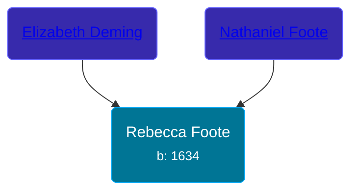

## 🟣 Rebecca Foote
<small>Age: 67y, 4m, 6d</small>

Daughter of [Nathaniel Foote](/people/6/64098820) and [Elizabeth Deming](/people/7/77201280)





### 📆 Events


Type | Date | Age at Event | Place
------ | ------ | ------ | ------
[Birth](#event-event-3) | 1634 |  |
[Death](#event-event-4) | 06 APR 1701 | 67y, 4m, 6d | Hadley, Massachusetts, USA



- **[Birth](#event-event-3)**
**Date**: 1634, Age:
**Place**:
- **[Death](#event-event-4)**
**Date**: 06 APR 1701, Age: 67y, 4m, 6d
**Place**: Hadley, Massachusetts, USA


## 👩‍❤️‍👨 Relationships

### 🔵 [Philip Smith](/people/6/61981014), b. 25 NOV 1632

#### Events


Type | Date | Age at Event | Place
------ | ------ | ------ | ------
[Marriage](#event-family-0-event-0) | Mar 1658 | 24y, 3m | Hadley, Massachusetts, USA



- **[Marriage](#event-family-0-event-0)**
**Date**: Mar 1658, Age: 24y, 3m
**Place**: Hadley, Massachusetts, USA


#### Children With Philip Smith
* 🔵 [Samuel Smith](/people/8/82805494), b. JAN 1658
* 🔵 [John Smith](/people/3/36040590), b. 18 DEC 1661
* 🔵 [Jonathan Smith](/people/8/86610734), b. 1663
* 🔵 [Philip Smith](/people/4/43477914), b. 1665
* 🟣 [Rebecca Smith](/people/7/76162584), b. 05 AUG 1669
* 🔵 [Nathaniel Smith](/people/8/82150350), b. 02 JAN 1671
* 🔵 [Joseph Smith](/people/4/405860), b. 1674
* 🔵 [Ichabod Smith](/people/3/31008221), b. 11 APR 1676
### 📰 Event Sources

####  Birth, 1634
* Ancestry of George W. Bush

####  Marriage, Mar 1658
* The Foote Family: or the Descendants of Nathaniel Foote  - 276
* Ancestry of George W. Bush
####  Death, 06 APR 1701
* History of the Town of Sunderland, Massachusetts  - 533
* Ancestry of George W. Bush
