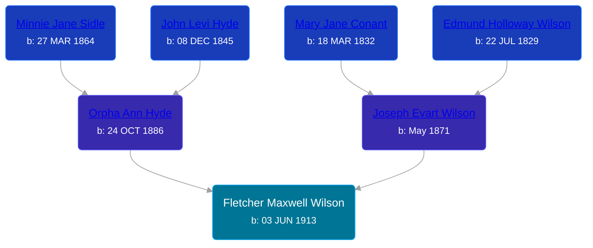

## 🔵 Fletcher Maxwell Wilson
<small>Age: 88y, 6m, 4d</small>

Son of [Joseph Evart Wilson](/people/5/57306025) and [Orpha Ann Hyde](/people/6/63932813)





### 📆 Events


Type | Date | Age at Event | Place
------ | ------ | ------ | ------
[Birth](#event-event-2) | 03 JUN 1913 |  | Tyrone Township, Kent, Michigan, USA
[Residence](#event-event-0) | 07 JAN 1920 | 6y, 7m, 4d | Grand Rapids, Kent, Michigan, United States
[Residence](#event-event-1) | 03 APR 1930 | 16y, 10m | Rio Grande, Colorado, USA
[Residence](#event-event-2) | 07 APR 1930 | 16y, 10m, 4d | Grand Rapids, Kent, Michigan, United States
[Residence](#event-event-3) | 17 APR 1940 | 26y, 10m, 14d | Grand Rapids, Kent, Michigan, United States
[Residence](#event-event-4) | 07 APR 1950 | 36y, 10m, 4d | Wyoming, Kent, Michigan, USA
[Death](#event-event-8) | 07 DEC 2001 | 88y, 6m, 4d |
Burial |  |  | Chapel Hill Memorial Gardens, Cascade, Kent, Michigan, USA



- **[Birth](#event-event-2)**
**Date**: 03 JUN 1913, Age:
**Place**: Tyrone Township, Kent, Michigan, USA
- **[Residence](#event-event-0)**
**Date**: 07 JAN 1920, Age: 6y, 7m, 4d
**Place**: Grand Rapids, Kent, Michigan, United States
- **[Residence](#event-event-1)**
**Date**: 03 APR 1930, Age: 16y, 10m
**Place**: Rio Grande, Colorado, USA
- **[Residence](#event-event-2)**
**Date**: 07 APR 1930, Age: 16y, 10m, 4d
**Place**: Grand Rapids, Kent, Michigan, United States
- **[Residence](#event-event-3)**
**Date**: 17 APR 1940, Age: 26y, 10m, 14d
**Place**: Grand Rapids, Kent, Michigan, United States
- **[Residence](#event-event-4)**
**Date**: 07 APR 1950, Age: 36y, 10m, 4d
**Place**: Wyoming, Kent, Michigan, USA
- **[Death](#event-event-8)**
**Date**: 07 DEC 2001, Age: 88y, 6m, 4d
**Place**:
- **Burial**
**Date**:
**Place**: Chapel Hill Memorial Gardens, Cascade, Kent, Michigan, USA


## 👩‍❤️‍👨 Relationships

### 🟣 [Marvel J. McDonald](/people/1/1324224), b. 1922

#### Events


Type | Date | Age at Event | Place
------ | ------ | ------ | ------
[Marriage](#event-family-0-event-0) | 26 SEP 1936 | 23y, 3m, 23d | Grand Rapids, Kent, Michigan, United States
[Divorce](#event-family-0-event-1) | 01 SEP 1943 | 30y, 2m, 28d | Grand Rapids, Kent, Michigan, United States



- **[Marriage](#event-family-0-event-0)**
**Date**: 26 SEP 1936, Age: 23y, 3m, 23d
**Place**: Grand Rapids, Kent, Michigan, United States
- **[Divorce](#event-family-0-event-1)**
**Date**: 01 SEP 1943, Age: 30y, 2m, 28d
**Place**: Grand Rapids, Kent, Michigan, United States


#### Children With Marvel J. McDonald
* 🔵 [Living Person](/people/5/53774374)
* 🔵 [Marvin Jean Wilson](/people/4/40728128), b. 25 OCT 1939
* 🟣 [Judith Ann Wilson](/people/5/50745588), b. 05 OCT 1940
### 🟣 [Beatrice Margaret Metzger](/people/7/79763948), b. 05 JUN 1922

#### Events


Type | Date | Age at Event | Place
------ | ------ | ------ | ------
[Marriage](#event-family-1-event-0) | 27 NOV 1946 | 33y, 5m, 24d | Wayland, Allegan, Michigan, USA



- **[Marriage](#event-family-1-event-0)**
**Date**: 27 NOV 1946, Age: 33y, 5m, 24d
**Place**: Wayland, Allegan, Michigan, USA


#### Children With Beatrice Margaret Metzger
* 🔵 [Duane LaVerne Wilson](/people/6/61086158), b. 19 APR 1945
* 🟣 [Living Person](/people/9/91180844)
## 📝 Notes
>   
  > Fletcher "Max" is listed twice in the 1930 census, once with his father in Colorado and once with his mother in Michigan. His parents were divorced by this time.
>   
  > Fletcher M. Wilson ran for mayor of Wyoming, Kent County, MI in 1979 and 1981 and was defeated both times. [source: http://politicalgraveyard.com/bio/wilson3.html]
### 📰 Event Sources

####  Birth, 03 JUN 1913
* Michigan, U.S., Birth Records, 1867-1914
>   
  > Name: Fletcher Maxwell Wilson  
  > Gender: Male  
  > Birth Date: 3 Jun 1913  
  > Birth Place: Tyrone, Michigan, USA  
  > Father: Joseph Evart Wilson  
  > Mother: Orpha Ann Hyde  
  > Jurisdiction Number: 351-699  
  > Reference Number: 26C  
  >

####  Residence, 07 JAN 1920
* 1920 US Census
>   
  > Name: Maxwell Wilson  
  > Age: 6  
  > Birth Year: abt 1914  
  > Birthplace: Michigan  
  > Home in 1920: Grand Rapids Ward 2, Kent, Michigan  
  > Street: Taylor Ave  
  > Residence Date: 1920  
  > Race: White  
  > Gender: Male  
  > Relation to Head of House: Son  
  > Marital Status: Single  
  > Father's Name: Orpha Wilson  
  > Father's Birthplace: Michigan  
  > Mother's Birthplace: Michigan  
  > Attended School: yes  
  >   
  > Household members:  
  > Orpha Wilson, 33, Head  
  > Joseph Wilson, 13, Son  
  > Lawrence Wilson, 8, Son  
  > Maxwell Wilson, 6, Son

####  Residence, 03 APR 1930
* 1930 US Census

####  Residence, 07 APR 1930
* 1930 US Census
>   
  > Name: Maxwell Wilson  
  > Birth Year: abt 1913  
  > Gender: Male  
  > Race: White  
  > Age in 1930: 17  
  > Birthplace: Michigan  
  > Marital Status: Single  
  > Relation to Head of House: Son  
  > Home in 1930: Precinct 5, Rio Grande, Colorado, USA  
  > Street Address: Experiment Station Road  
  > Dwelling Number: 11  
  > Family Number: 12  
  > Attended School: No  
  > Able to Read and Write: Yes  
  > Father's Birthplace: Michigan  
  > Mother's Birthplace: Michigan  
  > Able to Speak English: Yes  
  >   
  > Household members (Name: Age)  
  > Joseph E Wilson: 58  
  > Maxwell Wilson: 17

####  Marriage, 26 SEP 1936
* Kent County Marriage Records
>   
  > Date of Record: 21 Sep 1936  
  > Date of Marriage: 26 Sep 1936  
  > Place of Marriage: Grand Rapids, Kent County, Michigan  
  > Groom: Max F. Wilson  
  > Bride: Marvel J. McDonald  
  > Groom's Birthplace: Kent County, Michigan  
  > Groom's Parents: Joseph Wilson and Orpha Hyde  
  > Groom's Prev. Marriages: 0  
  > Bride's Birthplace: Grand Rapids, Kent County, Michigan  
  > Bride's Parents: Archie McDonald and Celia House  
  > Bride's Prev. Marriages: 0

####  Residence, 17 APR 1940
* 1940 US Census
>   
  > Name: Fletcher M Wilson  
  > Age: 27  
  > Estimated Birth Year: abt 1913  
  > Gender: Male  
  > Race: White  
  > Birthplace: Michigan  
  > Marital Status: Married  
  > Relation to Head of House: Head  
  > Home in 1940: Grand Rapids, Kent, Michigan  
  > Map of Home in 1940:   
  > Street: Tzplan Ave NE  
  > House Number: 1210  
  > Farm: No  
  > Inferred Residence in 1935: Grand Rapids, Kent, Michigan  
  > Residence in 1935: Grand Rapids  
  > Sheet Number: 14A  
  > Number of Household in Order of Visitation: 322  
  > Occupation: Truck Driver  
  > House Owned or Rented: Rented  
  > Value of Home: 16  
  > Attended School or College: No  
  > Highest Grade Completed: High School, 2nd year  
  > Hours Worked Week Prior to Census: 42  
  > Class of Worker: Wage or salary worker in private work  
  > Weeks Worked in 1939: 52  
  > Income: 540  
  > Income Other Sources: No  
  >   
  > Household members:  
  > Fletcher M Wilson, 27, Head  
  > Marvel J Wilson, 19, Wife  
  > William D Wilson, 2, Son  
  > Marvin G Wilson, 5/12, Son  
  >

####  Divorce, 01 SEP 1943
* Michigan, Divorce Records, 1897-1952
>   
  > Name: Fletcher M Wilson  
  > Marriage Date: 26 Sep 1936  
  > Marriage Place: Grand Rapids, Michigan  
  > Decree Date: 1 Sep 1943  
  > Decree Place: Kent  
  > Spouse Name: Marvel Wilson  
  > State File Number: 41 10734  
  > Docket Number: 45867  
  > Number of Children: 3  
  > Divorce Status: Granted

####  Marriage, 27 NOV 1946
* Michigan, Marriage Records, 1867-1952
>   
  > Name: Beatrice Margaret Peterson  
  > [Beatrice Margaret Matzger]   
  > Gender: Female  
  > Race: White  
  > Birth Year: abt 1922  
  > Birth Place: Allegan County, Michigan  
  > Marriage Date: 27 Nov 1946  
  > Marriage Place: Wayland, Allegan, Michigan, USA  
  > License County: Allegan  
  > Age: 24  
  > Residence Place: Moline, Michigan  
  > Father: Ralph Matzger  
  > Mother: Bessie Kobel  
  > Spouse: Fletcher Marwell Wilson  
  > Spouse Gender: Male  
  > Spouse Race: White  
  > Spouse Age: 32  
  > Spouse Birth Place: Kent County, Michigan  
  > Spouse Residence Place: Grand Rapkds, Michigan  
  > Spouse Father: Joseph Wilson  
  > Spouse Mother: Orpha Hyde  
  > County File Number: 451  
  > State File Number: 3 5872  
  > Film: 4  
  > Film Title: Montcalm 24-St. Clair 24  
  > Film Description: Allegan (1945) - Alpena (1928)
####  Residence, 07 APR 1950
* 1950 US Census
>   
  > Name: Fletcher M Wilson  
  > Age: 36  
  > Birth Date: abt 1914  
  > Gender: Male  
  > Birth Place: Michigan  
  > Marital Status: Married  
  > Relation to Head of House: Head  
  > Residence Date: 1950  
  > Home in 1950: Wyoming, Kent, Michigan, USA  
  > Street Name: Longstreet Ave  
  > House Number: 2705  
  > Dwelling Number: 96  
  > Farm: No  
  > Occupation: Jon Setter  
  > Industry: Small Parts Diesel Motors  
  > Occupation Category: Working  
  > Hours Worked: 48  
  > Worker Class: Private  
  >   
  > Household members:  
  > Fletcher M Wilson, 36, Head  
  > Beatrice M Wilson, 27, Wife  
  > William D Wilson, 12, Son  
  > Marvin J Wilson, 10, Son  
  > Judith A Wilson, 9, Daughter  
  > Duane L Peterson, 4, Stepson  
  >

####  Death, 07 DEC 2001
* The Grand Rapids Press
>   
  > WILSON -- Fletcher M. Wilson, aged 88, passed away December 7, 2001. Mr. Wilson retired from General Motors after 31 years of service. He was a member of Crescent Lodge #322, Past High Priest of the Royal Arch,member of Scottish Rite, Saladin Shrine and Furniture City #326 High Twelve; Past High Priest of White Shrine, lifetime member of Moose Lodge #50 and Associate Guardian of Job's Daughters. He was proceeded in death by his parents; three brothers; one sister, one grandchild and two great grandchildren. Mr. Wilson is sruvived by his wife of 55 years, Beatrice (Metzger); his children, William (Bill) and Judy Wilson, Marv (Bud) Wilson, of FL, Judith Jeske, Duane and Martha Wilson and Beatrice and Dennis Hartley; 29 grandchildren and many great grandchildrenas well as many nieces and nephews. Funeral services will be held on Monday, December 10 at 1 p.m. at Van Strien - Creston Chapel with interment to follow at CHapel Hill Memorial Gardens.
* U.S., Social Security Death Index, 1935-2014
>   
  > Name: FLETCHER M WILSON  
  > Birth: 03 Jun 1913  
  > Death: 07 Dec 2001 (V)  
  > Last Residence: 34446 (Homosassa, Citrus, FL)  
  > Last Benefit: (none specified)  
  > SSN: ###-##-####  
  > Issued: Michigan
