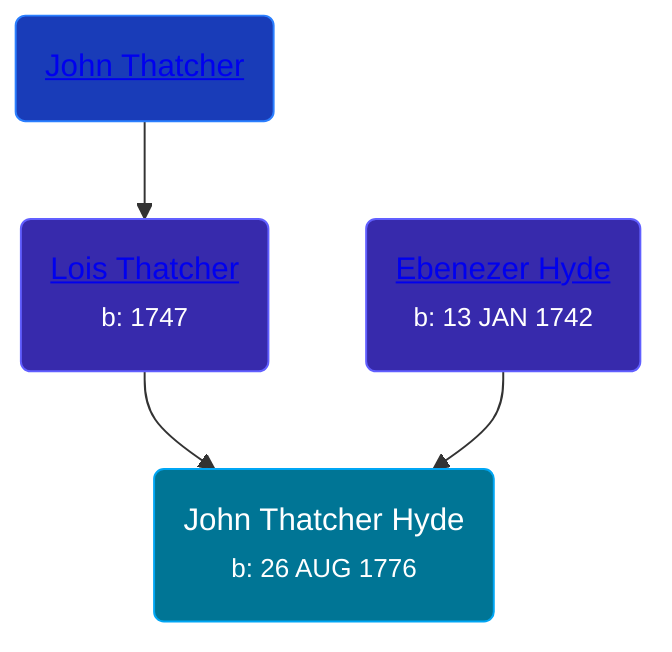

## 🔵 John Thatcher Hyde
<small>Age: 71y, 10m, 14d</small>

Son of [Ebenezer Hyde](/people/1/14535025) and [Lois Thatcher](/people/9/92113144)





### 📆 Events


Type | Date | Age at Event | Place
------ | ------ | ------ | ------
[Birth](#event-event-2) | 26 AUG 1776 |  | Vermont, USA
[Residence](#event-event-0) | 1810 | 33y, 3m, 4d | Angelica, Allegany, New York, USA
[Residence](#event-event-1) | 1840 | 63y, 3m, 4d | Amity, Allegany, New York, USA
[Death](#event-event-5) | 10 JUL 1848 | 71y, 10m, 14d | Amity, Allegany, New York, USA
[Burial](#event-event-6) |  |  | Abbot Cemetery, Amity, Allegany, New York, USA



- **[Birth](#event-event-2)**
**Date**: 26 AUG 1776, Age:
**Place**: Vermont, USA
- **[Residence](#event-event-0)**
**Date**: 1810, Age: 33y, 3m, 4d
**Place**: Angelica, Allegany, New York, USA
- **[Residence](#event-event-1)**
**Date**: 1840, Age: 63y, 3m, 4d
**Place**: Amity, Allegany, New York, USA
- **[Death](#event-event-5)**
**Date**: 10 JUL 1848, Age: 71y, 10m, 14d
**Place**: Amity, Allegany, New York, USA
- **[Burial](#event-event-6)**
**Date**:
**Place**: Abbot Cemetery, Amity, Allegany, New York, USA


## 👩‍❤️‍👨 Relationships

### 🟣 [Phebe Percis Dike](/people/4/41577072), b. 1777

#### Events


Type | Date | Age at Event | Place
------ | ------ | ------ | ------
[Marriage](#event-family-0-event-0) | 1798 | 21y, 3m, 4d |



- **[Marriage](#event-family-0-event-0)**
**Date**: 1798, Age: 21y, 3m, 4d
**Place**:


#### Children With Phebe Percis Dike
* 🟣 [Living Person](/people/4/44848664)
* 🟣 [Living Person](/people/4/47693044)
* 🔵 [Thatcher Hyde](/people/3/39742544), b.
* 🔵 [Hannah Hyde](/people/2/2490748), b. 04 NOV 1804
* 🟣 [Lois Hyde](/people/8/83724316), b. about 1808
* 🔵 [Dewitt Clinton Hyde](/people/4/47530864), b. about 1909
### 📰 Event Sources

####  Birth, 26 AUG 1776
* History of Allegany County, N.Y  - 169
* The Hyde Ancestors of Lawrence Hyde, 1888-1960

####  Residence, 1810
* 1810 US Census

####  Residence, 1840
* 1840 US Census

####  Death, 10 JUL 1848
* History of Allegany County, N.Y
* findagrave.com

####  Burial
* findagrave.com
>   
  > Hyde, John T., d. July 10, 1848, age 81y -- --
####  Marriage, 1798
* History of Allegany County, N.Y
* Allegany County and It's People
* The Hyde Ancestors of Lawrence Hyde, 1888-1960
