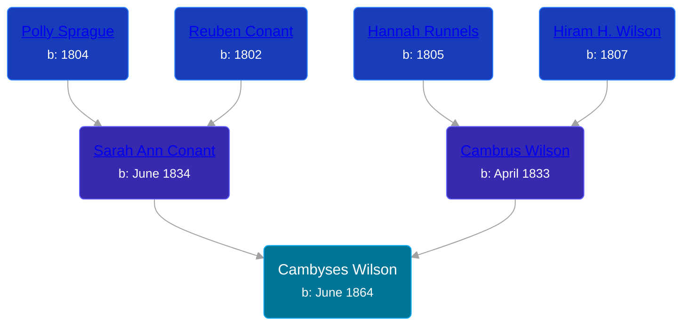

## 🔵 Cambyses Wilson

Son of [Cambrus Wilson](/people/8/82575654) and [Sarah Ann Conant](/people/3/3929404)





### 📆 Events


Type | Date | Age at Event | Place
------ | ------ | ------ | ------
Birth | June 1864 |  | New York, USA
[Residence](#event-event-0) | 15 JUN 1870 | 6y, 15d | Savannah, Wayne, New York, USA
[Residence](#event-event-1) | 04 JUN 1880 | 16y, 4d | Butler, Wayne, New York, USA
[Residence](#event-event-2) | 04 JUN 1900 | 36y, 4d | Wolcott, Wayne, New York, USA



- **Birth**
**Date**: June 1864, Age:
**Place**: New York, USA
- **[Residence](#event-event-0)**
**Date**: 15 JUN 1870, Age: 6y, 15d
**Place**: Savannah, Wayne, New York, USA
- **[Residence](#event-event-1)**
**Date**: 04 JUN 1880, Age: 16y, 4d
**Place**: Butler, Wayne, New York, USA
- **[Residence](#event-event-2)**
**Date**: 04 JUN 1900, Age: 36y, 4d
**Place**: Wolcott, Wayne, New York, USA


### 📰 Event Sources

####  Residence, 15 JUN 1870
* 1870 US Census

####  Residence, 04 JUN 1880
* 1880 US Census

####  Residence, 04 JUN 1900
* 1900 US Census
