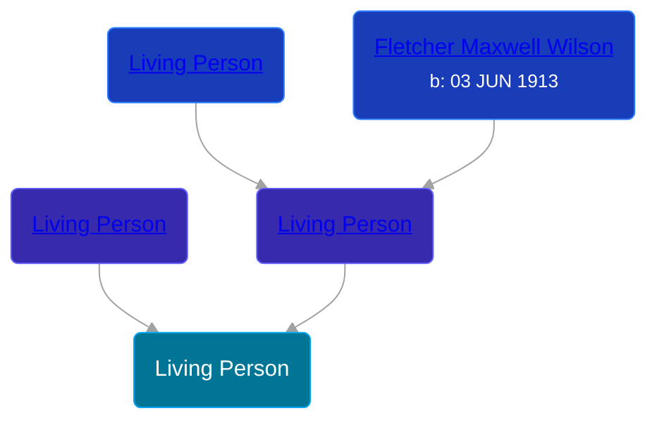

## 🔵 Living Person

Son of [Living Person](/people/5/53774374) and [Living Person](/people/2/25459314)



```mermaid
graph
classDef grands fill:#193cb8,stroke:#2b7fff,stroke-width:1px,color:#fff;
classDef parents fill:#372aac,stroke:#615fff,stroke-width:1px,color:#fff;
classDef primary fill:#007595,stroke:#00a6f4,stroke-width:1px,color:#fff;
34424064(Living Person):::primary
25459314(<a class="text-white" href="/people/2/25459314">Living Person</a>):::parents-->34424064
53774374(<a class="text-white" href="/people/5/53774374">Living Person</a>):::parents-->34424064
1324224(<a class="text-white" href="/people/1/1324224">Living Person</a>):::grands-->53774374
32597724(<a class="text-white" href="/people/3/32597724">Fletcher Maxwell Wilson</a><br /><small>b: 03 JUN 1913</small>):::grands-->53774374
linkStyle default stroke:#a1a1a1
```

