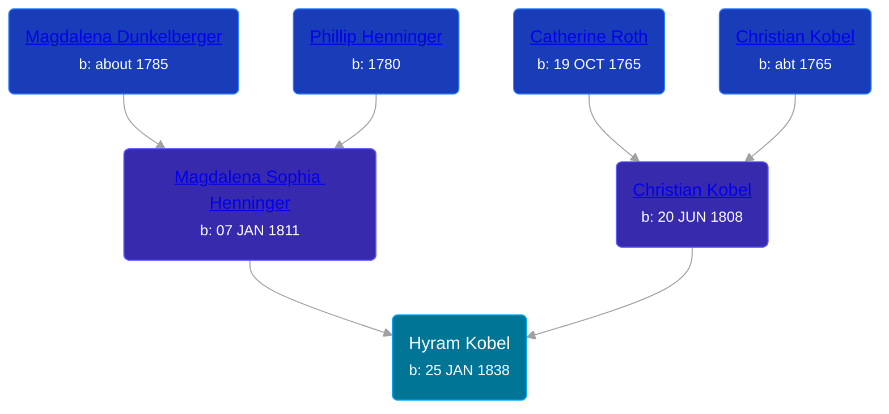

## 🔵 Hyram Kobel
<small>Age: 1y, 7m, 9d</small>

Son of [Christian Kobel](/people/1/17423128) and [Magdalena Sophia Henninger](/people/6/64241610)





### 📆 Events


Type | Date | Age at Event | Place
------ | ------ | ------ | ------
Birth | 25 JAN 1838 |  | Wayne, Ohio, USA
Death | 04 SEP 1839 | 1y, 7m, 9d | Wayne, Ohio, USA



- **Birth**
**Date**: 25 JAN 1838, Age:
**Place**: Wayne, Ohio, USA
- **Death**
**Date**: 04 SEP 1839, Age: 1y, 7m, 9d
**Place**: Wayne, Ohio, USA

