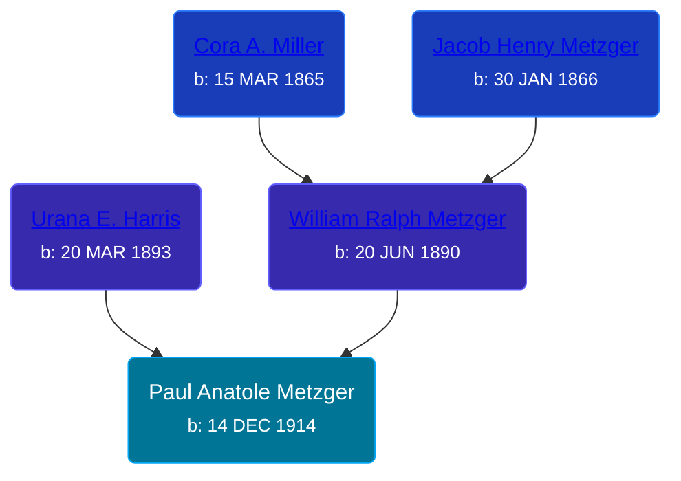

## 🔵 Paul Anatole Metzger
<small>Age: 36y, 5m, 12d</small>

Son of [William Ralph Metzger](/people/6/66898263) and [Urana E. Harris](/people/8/8274504)





### 📆 Events


Type | Date | Age at Event | Place
------ | ------ | ------ | ------
[Birth](#event-event-2) | 14 DEC 1914 |  | Collet, Jay, Indiana, USA
[Residence](#event-event-0) | 12 JAN 1920 | 5y, 28d | Columbia, Whitley, Indiana, USA
[Residence](#event-event-1) | 14 MAY 1930 | 15y, 5m | Dorr Township, Allegan, Michigan, USA
[Death](#event-event-5) | 26 MAY 1951 | 36y, 5m, 12d | San Diego, San Diego, California, USA
[Burial](#event-event-6) | 31 MAY 1951 | 36y, 5m, 17d | Fort Roescrans National Cemetery, San Diego, San Diego, California, USA



- **[Birth](#event-event-2)**
**Date**: 14 DEC 1914, Age:
**Place**: Collet, Jay, Indiana, USA
- **[Residence](#event-event-0)**
**Date**: 12 JAN 1920, Age: 5y, 28d
**Place**: Columbia, Whitley, Indiana, USA
- **[Residence](#event-event-1)**
**Date**: 14 MAY 1930, Age: 15y, 5m
**Place**: Dorr Township, Allegan, Michigan, USA
- **[Death](#event-event-5)**
**Date**: 26 MAY 1951, Age: 36y, 5m, 12d
**Place**: San Diego, San Diego, California, USA
- **[Burial](#event-event-6)**
**Date**: 31 MAY 1951, Age: 36y, 5m, 17d
**Place**: Fort Roescrans National Cemetery, San Diego, San Diego, California, USA


## 👩‍❤️‍👨 Relationships

### 🟣 [Living Person](/people/5/52781594)

### 📰 Event Sources

####  Birth, 14 DEC 1914
* Indiana, Birth Certificates, 1907-1940
>   
  > Name:Paul Anatole Metzger  
  > Gender:Male  
  > Birth Date:14 Dec 1914  
  > Birth Place:Collett, Jay, Indiana, USA  
  > Registration Year:1914  
  > Father:Rolph Metzger  
  > Mother:Urana Harris  
  > Certificate Number:23089  
  > Roll number:007  
  > Agency:Indiana State Dept. of Health  
  > Volume Range:763 - 769

####  Residence, 12 JAN 1920
* 1920 US Census

####  Residence, 14 MAY 1930
* 1930 US Census

####  Death, 26 MAY 1951
* California, Death Index, 1940-1997
>   
  > Name: Paul A Metzger  
  > Gender: Male  
  > Birth Date: 14 Dec 1914  
  > Birth Place: Indiana  
  > Death Date: 26 May 1951  
  > Death Place: San Diego  
  > Mother's Maiden Name: Harris  
  > Father's Surname: Metzger

####  Burial, 31 MAY 1951
* U.S. National Cemetery Interment Control Forms, 1928-1962
>   
  > Name: Paul A Metzgar  
  > Death Date: 26 May 1951  
  > Cemetery: Fort Rosecrans National Cemetery  
  > Burial Location: San Diego, California
* U.S. Veterans Gravesites, ca.1775-2006
>   
  > Name: Paul A Metzger  
  > Service Info.: US MARINE CORPS WORLD WAR II  
  > Birth Date: 14 Dec 1914  
  > Death Date: 26 May 1951  
  > Service Start Date: 19 Apr 1944  
  > Interment Date: 31 May 1951  
  > Cemetery: Ft. Rosecrans National Cemetery  
  > Cemetery Address: P.O. Box 6237 San Diego, CA 92166  
  > Buried At: Section L Site 136