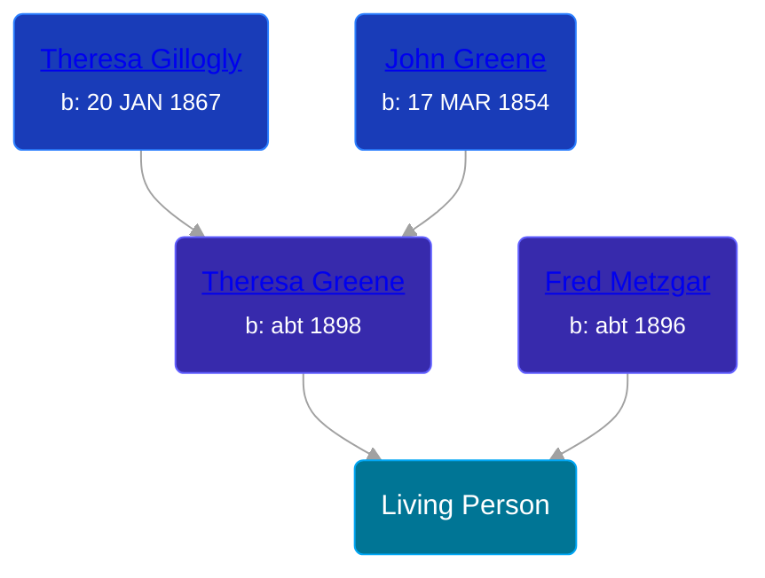

## 🔵 Living Person

Son of [Fred Metzgar](/people/6/6628596) and [Theresa Greene](/people/2/22213557)



```mermaid
graph
classDef grands fill:#193cb8,stroke:#2b7fff,stroke-width:1px,color:#fff;
classDef parents fill:#372aac,stroke:#615fff,stroke-width:1px,color:#fff;
classDef primary fill:#007595,stroke:#00a6f4,stroke-width:1px,color:#fff;
35414337(Living Person):::primary
22213557(<a class="text-white" href="/people/2/22213557">Theresa Greene</a><br /><small>b: abt 1898</small>):::parents-->35414337
67581747(<a class="text-white" href="/people/6/67581747">Theresa Gillogly</a><br /><small>b: 20 JAN 1867</small>):::grands-->22213557
71088434(<a class="text-white" href="/people/7/71088434">John Greene</a><br /><small>b: 17 MAR 1854</small>):::grands-->22213557
6628596(<a class="text-white" href="/people/6/6628596">Fred Metzgar</a><br /><small>b: abt 1896</small>):::parents-->35414337
linkStyle default stroke:#a1a1a1
```

