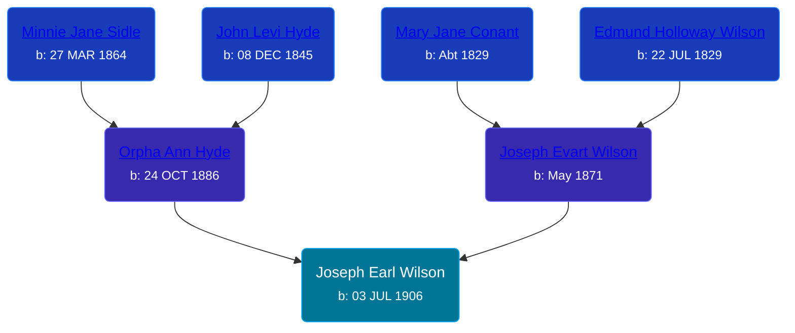

## 🔵 Joseph Earl Wilson

Son of [Joseph Evart Wilson](/people/5/57306025) and [Orpha Ann Hyde](/people/6/63932813)





### 📆 Events


Type | Date | Age at Event | Place
------ | ------ | ------ | ------
Birth | 03 JUL 1906 |  | Michigan, USA
[Residence](#event-event-0) | 1910 | 3y, 4m, 27d | Tyrone Township, Kent, Michigan, USA
[Residence](#event-event-1) | 07 JAN 1920 | 13y, 6m, 4d | Grand Rapids, Kent, Michigan, United States
[Residence](#event-event-2) | 1930 | 23y, 4m, 27d | Grand Rapids, Kent, Michigan, United States
[Residence](#event-event-3) | 1940 | 33y, 4m, 27d | Grand Rapids, Kent, Michigan, United States
Burial | 26 SEP 1967 | 61y, 2m, 23d | Greenwood Cemetery, Sparta, Kent, Michigan, USA



- **Birth**
**Date**: 03 JUL 1906, Age:
**Place**: Michigan, USA
- **[Residence](#event-event-0)**
**Date**: 1910, Age: 3y, 4m, 27d
**Place**: Tyrone Township, Kent, Michigan, USA
- **[Residence](#event-event-1)**
**Date**: 07 JAN 1920, Age: 13y, 6m, 4d
**Place**: Grand Rapids, Kent, Michigan, United States
- **[Residence](#event-event-2)**
**Date**: 1930, Age: 23y, 4m, 27d
**Place**: Grand Rapids, Kent, Michigan, United States
- **[Residence](#event-event-3)**
**Date**: 1940, Age: 33y, 4m, 27d
**Place**: Grand Rapids, Kent, Michigan, United States
- **Burial**
**Date**: 26 SEP 1967, Age: 61y, 2m, 23d
**Place**: Greenwood Cemetery, Sparta, Kent, Michigan, USA


## 👩‍❤️‍👨 Relationships

### 🟣 [Ruth ](/people/7/72945090), b. 1912

#### Children With Ruth
* 🔵 [Living Person](/people/9/92908178)
* 🟣 [Living Person](/people/7/73308950)
* 🟣 [Joy Dawn Wilson](/people/2/29575132), b. 13 JAN 1930
* 🟣 [Dixie Lee Wilson](/people/8/87584724), b. 06 AUG 1932
* 🔵 [Gary Lee Wilson](/people/8/83638300), b. 08 JAN 1946
### 📰 Event Sources

####  Residence, 1910
* 1910 US Census

####  Residence, 07 JAN 1920
* 1920 US Census
>   
  > Name: Joseph Wilson  
  > Age: 13  
  > Birth Year: abt 1907  
  > Birthplace: Michigan  
  > Home in 1920: Grand Rapids Ward 2, Kent, Michigan  
  > Street: Taylor Ave  
  > Residence Date: 1920  
  > Race: White  
  > Gender: Male  
  > Relation to Head of House: Son  
  > Marital Status: Single  
  > Father's Name: Orpha Wilson  
  > Father's Birthplace: Michigan  
  > Mother's Birthplace: Michigan  
  > Able to Speak English: Yes  
  > Attended School: yes  
  > Able to read: Yes  
  > Able to Write: Yes  
  >   
  > Household members:  
  > Orpha Wilson, 33, Head  
  > Joseph Wilson, 13, Son  
  > Lawrence Wilson, 8, Son  
  > Maxwell Wilson, 6, Son

####  Residence, 1930
* 1930 US Census

####  Residence, 1940
* 1940 US Census
