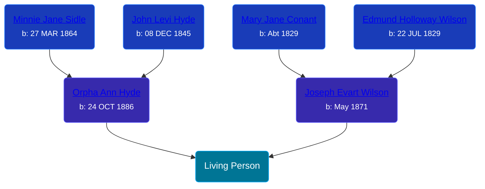

## 🔵 Living Person

Son of [Joseph Evart Wilson](/people/5/57306025) and [Orpha Ann Hyde](/people/6/63932813)





## 👩‍❤️‍👨 Relationships

### 🟣 [Living Person](/people/7/72945090)

#### Children With Living Person
* 🔵 [Living Person](/people/9/92908178)
* 🟣 [Living Person](/people/7/73308950)
* 🟣 [Joy Dawn Wilson](/people/2/29575132), b. 13 JAN 1930
* 🟣 [Dixie Lee Wilson](/people/8/87584724), b. 06 AUG 1932
* 🔵 [Gary Lee Wilson](/people/8/83638300), b. 08 JAN 1946