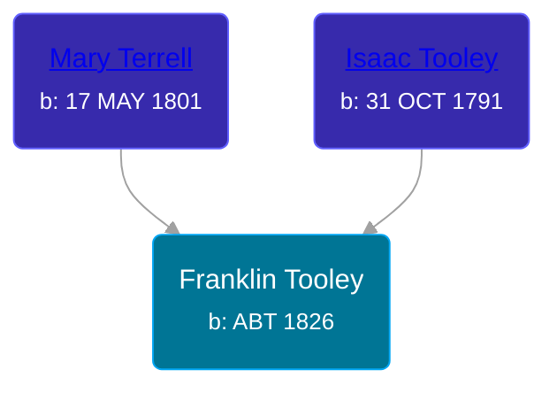

## 🔵 Franklin Tooley

Son of [Isaac Tooley](/people/6/65071054) and [Mary Terrell](/people/3/36199064)





### 📆 Events


Type | Date | Age at Event | Place
------ | ------ | ------ | ------
Birth | ABT 1826 |  |
[Residence](#event-event-0) | 11 SEP 1850 | 24y, 9m, 11d | Shelby, Orleans, New York, USA
[Residence](#event-event-1) | 23 JUN 1860 | 34y, 6m, 23d | Paris Township, Kent, Michigan, USA



- **Birth**
**Date**: ABT 1826, Age:
**Place**:
- **[Residence](#event-event-0)**
**Date**: 11 SEP 1850, Age: 24y, 9m, 11d
**Place**: Shelby, Orleans, New York, USA
- **[Residence](#event-event-1)**
**Date**: 23 JUN 1860, Age: 34y, 6m, 23d
**Place**: Paris Township, Kent, Michigan, USA


### 📰 Event Sources

####  Residence, 11 SEP 1850
* 1850 US Census

####  Residence, 23 JUN 1860
* 1860 US Census
