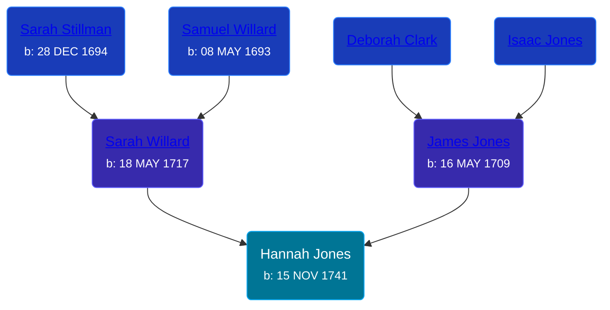

## 🟣 Hannah Jones
<small>Age: 73y, 6m, 27d</small>

Daughter of [James Jones](/people/6/61233476) and [Sarah Willard](/people/2/24374592)





### 📆 Events


Type | Date | Age at Event | Place
------ | ------ | ------ | ------
[Birth](#event-event-3) | 15 NOV 1741 |  | Saybrook, Middlesex, Connecticut, USA
Death | 12 JUN 1815 | 73y, 6m, 27d |



- **[Birth](#event-event-3)**
**Date**: 15 NOV 1741, Age:
**Place**: Saybrook, Middlesex, Connecticut, USA
- **Death**
**Date**: 12 JUN 1815, Age: 73y, 6m, 27d
**Place**:


## 👩‍❤️‍👨 Relationships

### 🔵 [Silas Gladding](/people/5/55129348), b. 08 MAY 1730

#### Events


Type | Date | Age at Event | Place
------ | ------ | ------ | ------
Marriage | 14 MAY 1762 | 20y, 5m, 29d | Saybrook, Middlesex, Connecticut, USA



- **Marriage**
**Date**: 14 MAY 1762, Age: 20y, 5m, 29d
**Place**: Saybrook, Middlesex, Connecticut, USA


#### Children With Silas Gladding
* 🟣 [Hannah Gladding](/people/8/88055086), b. 16 NOV 1762
* 🔵 [James Gladding](/people/5/58213774), b. 01 JAN 1775
### 📰 Event Sources

####  Birth, 15 NOV 1741
* The New England Historical and Genealogical Register  - 313

####  Marriage, 14 MAY 1762