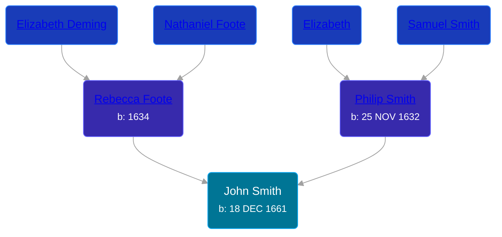

## 🔵 John Smith

Son of [Philip Smith](/people/6/61981014) and [Rebecca Foote](/people/3/32470572)





### 📆 Events


Type | Date | Age at Event | Place
------ | ------ | ------ | ------
[Birth](#event-event-2) | 18 DEC 1661 |  |



- **[Birth](#event-event-2)**
**Date**: 18 DEC 1661, Age:
**Place**:


### 📰 Event Sources

####  Birth, 18 DEC 1661
* History of the Town of Sunderland, Massachusetts  - 533
* The Foote Family: or the Descendants of Nathaniel Foote  - 277